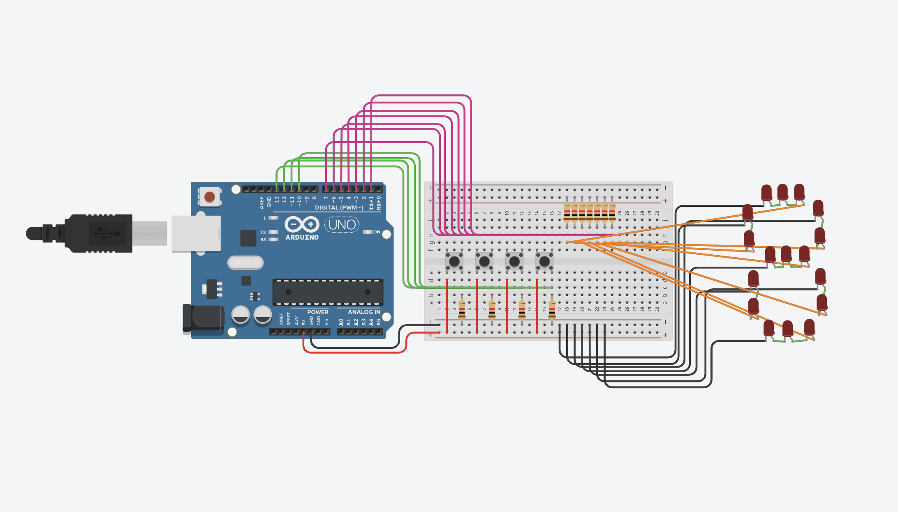
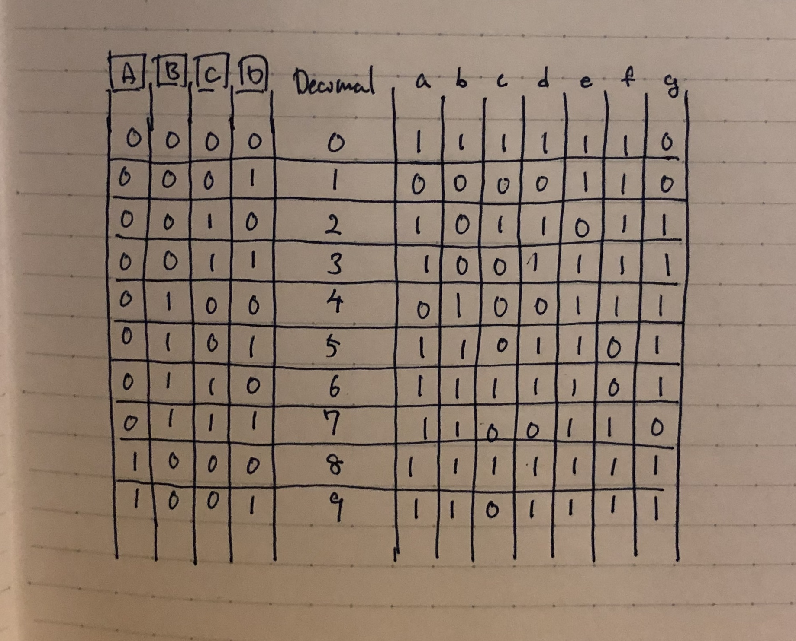
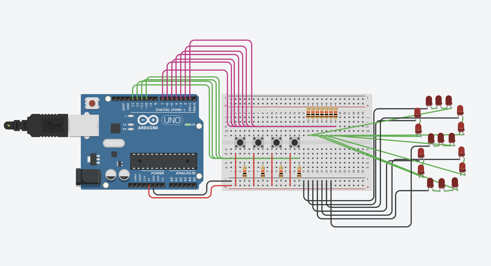
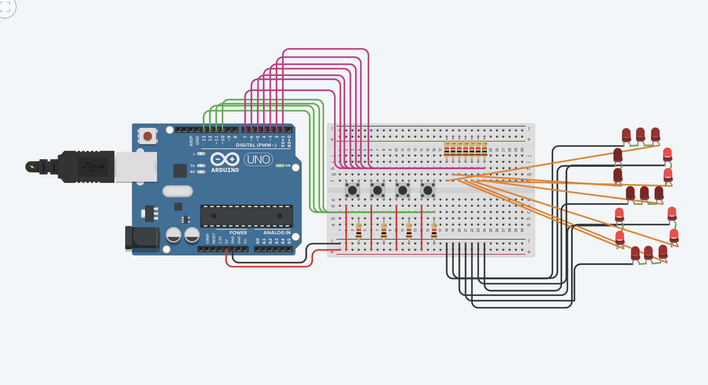

Homeworks
========

Arduino C
------

### 0. Revisiting For Loop functions 

This section is the introduction task to arduino. We did a for loop program when learning bash in the previous unit, and in this task, to familiarize with the new programming language (i.e. syntax), we did an introductory course, which was to recreate the for loop task that we did in bash, in arduino. We created the exact same function but using a different programming language. The tasks were: 

⓪ Create a program that prints 1000 times a greeting from your language. E.g: Hola, Hola, Hola,...

① Create a program that prints the years from 1000 to 2019 with the word year attached. E.g: Year 1000, Year 1001,...

② Create a program that prints all the odd numbers from 1001 to 1 (reversed).

③ Create a program that prints the addition of all the odd numbers, and all the even numbers from 1 to 1000.

④ Create a program that prints 100 factors of the number 7. E.g. 7, 14, 21, ...

⑤ Create a program that prints 1000 numbers in the sequence 012345601234560...

⑥ Create a program that prints the ordinal numbers from 1st to 100th, with the proper ending (st, nd, th). E.g: 1st, 2nd, 3rd, ...

By using tinkercad, which is an online software, where you can use it to write the code and run it in a virtual circuit to check if the code is meeting its expectations. These are codes that I came up with:

```sh 
#Program 0: prints out 1000 hellos
void setup()
{
  Serial.begin(9600);
  for (int count=0; count<1000; count++) {
    Serial.println("Hello");
  }
}

#Program 1: prints out years from 1000 to 2019  
void setup()
{
  Serial.begin(9600);
  for (int count=1000; count<=2019; count++) {
    Serial.print ("Year ");
    Serial.println (count);
  }
}

#Program 2: counts down the odd numbers form 1001 to 1
void setup()
{
  Serial.begin(9600);
  for (int count=1001; count>=1; count=count-2)
  {
    Serial.println (count);
  }
}
 
#Program 3: Calculate the sum of each, odd and even numbers from 1 to 100
void setup()
{
  Serial.begin(9600);
  float odd = 0;
  float even = 0;
  
  for (int a=0; a<=1000; a+=2)
  {
    even+=a;
  }
  
  for (int b=1; b<1000; b+=2)
  {
    odd+=b;
  }
  
  Serial.println(even);
  Serial.println(odd);
}


#Program 4: Prints 100 factors of 7
void setup()
{
  Serial.begin(9600);
  int num = 7;
  for (int count=1; count<100; count++ ) 
  {
    num+=7;
    Serial.println(num);
  }
}
  

#Program 5: Prints out sequence 01234560123.. for 1000 times
void setup()
{
  Serial.begin(9600);
  
  int num = -1;
  for (int count=1; count<1000; count++) 
  {
    num++;
    Serial.println(num);
    if (num==6)
    {
      num = -1;
    }
  }
}

#Program 6: Count numbers using st, nd, rd, th... from 1st to 1000th 
void setup()
{
  Serial.begin(9600);
  for (int num=1; num<=100; num++)
  {
    if (num%10==1 && num!=11)
    {
      Serial.print(num);
      Serial.println ("st");
    }
    else if (num%10==2 && num!=12)
    {
      Serial.print(num);
      Serial.println ("nd");
    }
    else if (num%10==3 && num!=13)
    {
      Serial.print(num);
      Serial.println ("rd");
    }
    else 
    {
      Serial.print(num);
      Serial.println ("th");
    }
  }
}
```
I only copied the setup() function of the program, because the rest of the code is exactly the same in every program. I could've also put these codes in the loop() function, although I did't want the code to execute infinite time, and instead I needed the code to executed only once. This is why I wrote it in the setup function. 

Comparing with the bash program it is very similar. You can tell that the two codes commands the computer to do the exact same thing. Although there are some difference in the syntaxes. 

First of all in arduino `Serial.begin(9600)`, is required in the beginning to execute the code. If this is not included in the code, the code itself would still be executed, although the result would not be printed on the console. 

Also the command for printing things is different between bash and arduino. In bash it is `echo \(message)`, although in arduino it is `Serial.println(\(message))`. The command `println`, means print the message and then go to a new line. Thus, without the "ln", this would just print out message in one line, without going down to a new line. 

Furthermore, another difference is that, when declaring a variable we always need to indicate what type of variable is it (i.e. whether if it's an int, string, etc.). Without indicating the the variable type, the computer would get confused, and would return an error.

### 1.Traffic Light Program

This is the virtual circuit of the program:


The following is the actual code of this program:

```sh 
// assigning integer for each leds (same number as the arduino input)
int redLight = 13; 
int yellowLight = 12;
int greenLight = 11;

void setup() {
  // the code would only run once
  // setup of which sources are the input and output
  pinMode(redLight, OUTPUT);
  pinMode(yellowLight, OUTPUT);
  pinMode(greenLight, OUTPUT); 
}

void loop() {
  // the code would run repeatedly
  // Calling out the function below, by assigning the arguments
  blinkColor(1000, redLight);
  blinkColor(1000, yellowLight);
  blinkColor(1000, greenLight);
}

// Parameters to reuse them
void blinkColor(int t, int color) {
  // parameters specified in the above loop function
  digitalWrite(color, HIGH);
  delay(t);
  digitalWrite(color, LOW);
  delay(t);
}
```

This code simply turns on the red led first, and then after 1 second, it turns on yellow light, and turn off the red, then after another second, does the same process but with green color. By calling out the blinkColor in the loop function, it runs infinitely until we stop the simulation. By using parameters in the blinkColor function, we can set different arguments in the same fucntion, in other words, reuse the same function but for another purpose. HIGH, means turn on, and LOW means turn off in arduino, and this appears a lot so it is better if we remember this.


### 2. Binary lights (Predevelopment)

This program should light the leds in 15 different ways by using the binary numbers.
Steps: 
1. Create 4 leds (Each representing the digits of binary numbers)
2. Create a for loop that counts until 15 
3. For each count convert decimal to binary using module(%)
4. If statements to assign when count%x is y then light the designated leds

```sh 
// Assiging the input numbers in the arudino board
int redLight = 13;
int blueLight = 12;
int yellowLight = 11;
int whiteLight = 10;

void setup() {
  pinMode(13, OUTPUT);
  pinMode(12, OUTPUT);
  pinMode(11, OUTPUT);
  pinMode(10, OUTPUT);
}

void loop() {
  // Calling the function 
  countBinary();
}

void countBinary() {
  for (int count=0; count<=15; count++) {
    //led D
    if (count%2 == 1) {
      digitalWrite(whiteLight, HIGH);
    } else {
      digitalWrite(whiteLight, LOW);
    }
    //led C
    if (count%4 > 1) {
      digitalWrite(yellowLight, HIGH);
    } else {
      digitalWrite(yellowLight, LOW);
    }
    //led B
    if (count%8 > 3) {
      digitalWrite(blueLight, HIGH); 
    } else {
      digitalWrite(blueLight, LOW);
    }
    //led A
    if (count%16 > 7) {
      digitalWrite(redLight, HIGH);
    } else {
      digitalWrite(redLight, LOW);
    }
    delay(1000);
  }
  
}
```
The outcome is that the 4 lights represent each digit in hte binary numbers, and that when the digit number is 1, then it turns on the light, when it is 0 then otherwise. In this program this is what is happening:

| Decimal | digit C | decimal%4 |
| --- | --- | --- |
| 1 | 0 | 0 |
| 2 | 0 | 1 |
| 3 | 1 | 2 | 
| 4 | 1 | 3 |
| 5 | 0 | 0 |
| 6 | 0 | 1 |
| 7 | 1 | 2 |

In this table we can see, how when the decimal%4 becomes bigger than 1, then C is 1. Therefore the code: 
```sh 
if (count%4 > 1) {
  digitalWrite(yellowLight, HIGH);
}
```
since the 1 means HIGH. The code works like this, and by representing each leds as digits A, B, C, D of binary numbers, we can light the 4 leds in 15 different ways, using the concept of binary numbers.


### 3. Development of Weekend Task (Predevelopment)

**Table 1:**

| butA | butB | out1 | out2 |
| --- | --- | --- | --- |
| 0 | 0 | 1 | 0 |
| 0 | 1 | 0 | 1 |
| 1 | 0 | 1 | 1 |
| 1 | 1 | 0 | 0 |

Step: 
1. Create variable for all inputs and outputs
2. Create if statements saying "if these inputs are on, and turn on these inputs"

```sh 
int butA = 13;
int butB = 12;
int out1 = 3;
int out2 = 4;

void setup() {
  pinMode(butA, INPUT);
  pinMode(butB, INPUT);
  pinMode(out1, OUTPUT);
  pinMode(out2, OUTPUT);
}

void loop() {
  if (digitalRead(butA)==LOW && digitalRead(butB)==LOW) {
    digitalWrite(out1, HIGH);
    digitalWrite(out2, LOW);
  } else if (digitalRead(butA)==LOW && digitalRead(butB)==HIGH) {
    digitalWrite(out1, LOW);
    digitalWrite(out2, HIGH);
  } else if {digitalRead(butA)==HIGH && digitalRead(butB)==LOW) {
    digitalWrite(out1, HIGH);
    digitalWrite(out2, HIGH);
   } else if (digitalRead(butA)==HIGH && digitalRead(butB)==HIGH) {
    digitalWrite(out1, LOW);
    digitalWrite(out2, LOW);
  }
}
```
This code is using conditional statements to decide on which output is HIGH and LOW, depending on which input is HIGH and LOW.
This is how the circuit would look like: 


**Table 2:**


| butA | butB | out1 | out2 |
| --- | --- | --- | --- |
| 0 | 0 | 1 | 0 |
| 0 | 1 | 0 | 1 |
| 1 | 0 | 0 | 1 |
| 1 | 1 | 1 | 1 |

The condition slightly changes, although the whole structure of the code is exactly the same. 
```sh 
int butA = 13;
int butB = 12;
int out1 = 3;
int out2 = 4;

void setup() {
  pinMode(butA, INPUT);
  pinMode(butB, INPUT);
  pinMode(out1, OUTPUT);
  pinMode(out2, OUTPUT);
}

void loop() {
  if (digitalRead(butA)==LOW && digitalRead(butB)==LOW) {
    digitalWrite(out1, HIGH);
    digitalWrite(out2, LOW);
  } else if (digitalRead(butA)==LOW && digitalRead(butB)==HIGH) {
    digitalWrite(out1, LOW);
    digitalWrite(out2, HIGH);
  } else if {digitalRead(butA)==HIGH && digitalRead(butB)==LOW) {
    digitalWrite(out1, LOW);
    digitalWrite(out2, HIGH);
   } else if (digitalRead(butA)==HIGH && digitalRead(butB)==HIGH) {
    digitalWrite(out1, HIGH);
    digitalWrite(out2, HIGH);
  }
}
```

**Table 3**


| butA | butB | but C | out1 | out2 |
| --- | --- | --- | --- | --- | 
| 0 | 0 | 0 | 1 | 1 | 
| 0 | 0 | 1 | 1 | 1 | 
| 0 | 1 | 0 | 1 | 0 | 
| 0 | 1 | 1 | 1 | 0 | 
| 1 | 0 | 0 | 0 | 1 | 
| 1 | 0 | 1 | 1 | 1 | 
| 1 | 1 | 0 | 1 | 1 | 
| 1 | 1 | 1 | 1 | 1 | 

This table is different from the last 2 tables, but the only difference is that there is one more input. Therefore there are more combinations of the buttons, and this mean that there will be more if statements in the code, although the structure is the same again, even for table 3.

```sh 
int butA = 13;
int butB = 12;
int butC = 11;
int out1 = 3;
int out2 = 4;

void setup() {
  pinMode(butA, INPUT);
  pinMode(butB, INPUT);
  pinMode(butC, INPUT);
  pinMode(out1, OUTPUT);
  pinMode(out2, OUTPUT);
}

void loop() {
  if (digitalRead(butA)==LOW && digitalRead(butB)==LOW && digitalRead(butC)==LOW) {
    digitalWrite(out1, HIGH);
    digitalWrite(out2, HIGH);
  } else if (digitalRead(butA)==LOW && digitalRead(butB)==LOW && digitalRead(butC)==HIGH) {
    digitalWrite(out1, HIGH);
    digitalWrite(out2, HIGH);
  } else if (digitalRead(butA)==LOW && digitalRead(butB)==HIGH && digitalRead(butC)==LOW) {
    digitalWrite(out1, HIGH);
    digitalWrite(out2, LOW);
  } else if (digitalRead(butA)==LOW && digitalRead(butB)==HIGH && digitalRead(butC)==HIGH) {
    digitalWrite(out1, HIGH);
    digitalWrite(out2, LOW);
  } else if (digitalRead(butA)==HIGH && digitalRead(butB)==LOW && digitalRead(butC)==LOW) {
    digitalWrite(out1, LOW);
    digitalWrite(out2, HIGH);
  } else if (digitalRead(butA)==HIGH && digitalRead(butB)==LOW && digitalRead(butC)==HIGH) {
    digitalWrite(out1, HIGH);
    digitalWrite(out2, HIGH);
  } else if (digitalRead(butA)==HIGH && digitalRead(butB)==HIGH && digitalRead(butC)==LOW) {
    digitalWrite(out1, HIGH);
    digitalWrite(out2, HIGH);
  } else {
    digitalWrite(out1, HIGH);
    digitalWrite(out2, HIGH);
  }
}
```

In this program the code becomes very long, but essentially we are doing the same thing in table 1 and 2, but with a lnger process, since there is one more input to consider.

### 4. Using Binary Gates for Weekend Task (Predevelopment)
**Table 1**

Using the same table as before, we are going to another code that performs exactly the same thing, but with a different method. By using binary gates. This is table for the first output.

| b\a | 0 | 1 |
| --- | --- | --- |
| 0 | 1 | 1 |
| 1 | 0 | 0 | 

What we can observe here is that, the light turns on (becomes 1) when the button a and b are both 0 and, when button a is 1 and b is 0. These are the 2 scenarios that the led out1 turns on. Therefore, by using the concept of binary gates, we can come up with the equation `NOT B`. When "Not B", out1 turns on. Now that we sorted out out1, we also need to think about out2. 

| b\a | 0 | 1 |
| --- | --- | --- |
| 0 | 0 | 1 |
| 1 | 1 | 0 |

This is the table for out2. The equation for when the out2 turns on is `(NOT A) AND B OR A AND (NOT B)`. Therefore, the  previous code can be modified as in the following: 

```sh 
int butA = 13;
int butB = 12;
int out1 = 3;
int out2 = 4;

void setup() {
  pinMode(butA, INPUT);
  pinMode(butB, INPUT);
  pinMode(out1, OUTPUT);
  pinMode(out2, OUTPUT);
}

void loop() {
  bool A = digitalRead(butA);
  bool B = digitalRead(butB);
  
  bool eq1 = !B;
  bool eq2 = !A & B | !B & A;
  
  digitalWrite(out1, eq1);
  digitalWrite(out2, eq2);
}
```

By using binary gates the code becomes a lot more concise, and still it does the exact same thing. 

**Table2**
This is essentially the same step: 
1. Create a table for both out1 and out2
2. Then come up with equations for each output using binary gates
Firstly, this is the table for out1:

| b\a | 0 | 1 |
| --- | --- | --- |
| 0 | 1 | 0 |
| 1 | 0 | 1 |

Then by looking at the table, we can find the equation for when out1 turn on. In this case it is
`(NOT A AND NOT B) OR (A AND B)`. For the out2, this is the table: 

| b\a | 0 | 1 |
| --- | --- | --- |
| 0 | 0 | 1 |
| 1 | 1 | 1 |

In this other case, we can come up with the equation `A OR B`. Using these tables and binary gates equations, we can come with the following code: 
```sh 
int butA = 13;
int butB = 12;
int out1 = 3;
int out2 = 4;

void setup() {
  pinMode(butA, INPUT);
  pinMode(butB, INPUT);
  pinMode(out1, OUTPUT);
  pinMode(out2, OUTPUT);
}

void loop() {
  bool A = digitalRead(butA);
  bool B = digitalRead(butB);
  
  bool eq1 = !A & !B | A & B;
  bool eq2 = A | B;
  
  digitalWrite(out1, eq1);
  digitalWrite(out2, eq2);
}
```

This is the modified code. As mentioned before, it does the exact same performance.

**Table 3**
The same step is taken in this one, but with one more input. The table would be like this below.

Table for out1: 

| c\ab | 00 | 01 | 11 | 10 |
| --- | --- | --- | --- | --- |
| 0 | 1 | 1 | 1 | 0 |
| 1 | 1 | 1 | 1 | 1 | 

Table for out2: 

| c\ab | 00 | 01 | 11 | 10 |
| --- | --- | --- | --- | --- |
| 0 | 1 | 0 | 1 | 1 |
| 1 | 1 | 0 | 1 | 1 | 

Then we find the equation that best fits the conditions in the table, using bunary gates.

Equation for out1: `NOT A OR B OR C`

Equation for out2: `NOT A AND NOT B OR A`

This is code for table 3: 

```sh 
int butA = 13;
int butB = 12;
int butC = 11;
int out1 = 3;
int out2 = 4;

void setup() {
  pinMode(butA, INPUT);
  pinMode(butB, INPUT);
  pinMode(butC, INPUT);
  pinMode(out1, OUTPUT);
  pinMode(out2, OUTPUT);
}

void loop() {
  bool A = digitalRead(butA);
  bool B = digitalRead(butB);
  bool C = digitalRead(butC);
  
  bool eq1 = !A | B | C;
  bool eq2 = !A & !B | A;
  
  digitalWrite(out1, eq1);
  digitalWrite(out2, eq2);
}
```

This should essentially perform the same thing with the previous code, with long for loops. In conclusion, by using binary gates, it allows us to make the code more simple and line efficient. 


### 5. Development of the digital number led program 

For this program we needed to create this using the concept of binary and binary gates:


Step 1: Create a diagram of the leds and decide how many buttons we need 

**Fig.1**

This figure 1 shows the diagram of how the digital numbers are structured. There are 7 leds, and using those leds, it should represent 0~9, which is 10 numbers. The mathematical operation shows that 10 is bigger than 2 to the power of 3 but smaller than 2 to the power of 4, indicating that we need 4 buttons which can represent each digit in binary, since we need 4 digits to represent 10 numbers in binary. 

Step 2: Create a virtual circuit in tinkercad.com

**Fig.2**

Figure 2 shows the intial circuit that I created. There are four buttons each associated with one resistor. Also there are many leds in the right. When talking a closer look at the leds, you may see how the 2-3 leds are connected together. The horizontally alligned leds are 3 in 1, and vertical ones are 2 in 1. I did this to make the result easier to see, so we can observe what is working and not.

Step 3: Draw a table for the buttons

**Fig.3**

In figure 3, 0 represents off, and 1 is on. Depending on which number to show on the leds, the buttons that needs to be pushed will change. This table shows that for example, to show 6 with the leds you need to turn on buttons B and C. Also for the leds, the led f is the only one that is turned off. Like this, in the table there is the information, for all of the numbers.

Step 4: Draw a table for each leds 

**Fig.4**

In this figure, I tried to create a table for each leds, so that I can see the pattern of when and when not the leds are on. By doing this, we can move on to the next step, which makes are code line efficient, and therefore easier to read.

Step 5: Write down the eqaution (using binary gates) for every led

**Fig.5**

Figure 5 shows the same drawing of the table, but I've done here is I showed the process of coming up with equations using binary gates. By using binary gates, as also mentioned above, it makes the code much more concise, and easier to see. Thus, for example, when there is an error in the program, it would be easier to locate the mistakes in the code, since there are less possible areas that error can occur. You don't need to scroll down the code, because the code is short enough to locate the error with one glance.

And finally this is the code for the entire program that I came up with:
```sh
int butA = 13;
int butB = 12;
int butC = 11;
int butD = 10;
int ledA = 7;
int ledB = 6;
int ledC = 5;
int ledD = 4;
int ledE = 3;
int ledF = 2;
int ledG = 1;

void setup()
{
  pinMode(butA, OUTPUT);
  pinMode(butB, OUTPUT);
  pinMode(butC, OUTPUT);
  pinMode(butD, OUTPUT);
  pinMode(ledA, INPUT);
  pinMode(ledB, INPUT);
  pinMode(ledC, INPUT);
  pinMode(ledD, INPUT);
  pinMode(ledE, INPUT);
  pinMode(ledF, INPUT);
  pinMode(ledG, INPUT);
}

void loop()
{
  bool a = digitalRead(butA);
  bool b = digitalRead(butB);
  bool c = digitalRead(butC);
  bool d = digitalRead(butD);
  
  bool eqA = (!a & !b & !c & !d) | (!a & b & !c & d) | (!a & c) | (a & !b & !c);
  bool eqB = (!a & c & d) | (!a & b) | (a & !b & !c);
  bool eqC = (!a & !b & !c & !d) | (a & !b & !c & !d) | (!a & !b & !c);
  bool eqD = (!a & !b & !c & !d) | (!a & b & !c & !d) | (!a & !b & c) | (!a & c & !d) | (a & !b);
  bool eqE = (!a & !c) | (!a & d) | (!a & b & c) | (a & !b & !c);
  bool eqF = (!a & !b) | (!a & !c & !d) | (!a & c & d) | (a & !b & !c);
  bool eqG = (!a & b & !c) | (!a & !b & c) | (!a & c & !d) | (a & !b & !c);
  
  digitalWrite(ledA, eqA);
  digitalWrite(ledB, eqB);
  digitalWrite(ledC, eqC);
  digitalWrite(ledD, eqD);
  digitalWrite(ledE, eqE);
  digitalWrite(ledF, eqF);
  digitalWrite(ledG, eqG);
}
```
 This is the final product, and I checked on the simulator to see if shows the numbers in the way I expected.
 
 **Fig6**
 Figure 6 shows the issue of the prototype. One problem was that the leds were very dark although they were on. The reason I thought wsa because of how several leds were connected together. This is why I moderated the circuit so that there is only one led connected to each input. Although this didn't change the issue. The led was still dark. This meant that there was another reason that was contributing to the dimness of the led. The real reason was in the code. 
 ```sh 
 void setup()
{
  pinMode(butA, OUTPUT);
  pinMode(butB, OUTPUT);
  pinMode(butC, OUTPUT);
  pinMode(butD, OUTPUT);
  pinMode(ledA, INPUT);
  pinMode(ledB, INPUT);
  pinMode(ledC, INPUT);
  pinMode(ledD, INPUT);
  pinMode(ledE, INPUT);
  pinMode(ledF, INPUT);
  pinMode(ledG, INPUT);
}
```
For the setup, buttons should be the inputs and the leds must be the outputs. Thus the correct code should instead be the following: 
```sh 
  pinMode(butA, INPUT);
  pinMode(butB, INPUT);
  pinMode(butC, INPUT);
  pinMode(butD, INPUT);
  pinMode(ledA, OUTPUT);
  pinMode(ledB, OUTPUT);
  pinMode(ledC, OUTPUT);
  pinMode(ledD, OUTPUT);
  pinMode(ledE, OUTPUT);
  pinMode(ledF, OUTPUT);
  pinMode(ledG, OUTPUT);
 ```
 Then I carried out the second test to see the circuit works, and this is the result:
 
 
 The issue of not being able to see the change in the leds were fixed, although the code was not correct. When none of the buttons are pushed, the leds should show the shape of 0. Clearly there is malfunction in the code, probably in the equation part, but this is another issue to tackle.
 
 
Practice with standard C
-------

### Conditional statements

```sh 
// 1. Check is the number is even or odd
#include <stdio.h>

int main(void) {
  int userNum;
  printf("Enter an integer below \n");
  scanf("%d", &userNum);
  if (userNum % 2 == 0) {
    printf("%d is an even integer", userNum);
  } else {
     printf("%d is an odd integer", userNum);
  }
  return 0;
}

// 2. Check if the number is positive or negative
#include <stdio.h>

int main(void) {
  int userNum; 
  printf("Enter a number below \n");
  scanf("%d", &userNum);
  if (userNum < 0) {
    printf("%d is a negative integer", userNum);
  } else {
    printf("%d is a positive integer", userNum);
  }
  return 0;
}

// 3. Check is the user is eligible for a casting a vote
#include <stdio.h>

int main(void) {
  int userAge;
  printf("Enter your age here: ");
  scanf("%d", &userAge);
  if (userAge < 20) {
    printf("You are not eligible for casting your vote");
  } else {
    printf("Congratulations! You are eligible for casting your vote.");
  }
  return 0;
}
 
// 4. Find the greatest number among the three input
#include <stdio.h>

int main(void) {
  int num1, num2, num3;
  printf("Enter three different numbers below \n");
  scanf("%d %d %d", &num1, &num2, &num3);
  printf("1st Number = %d \n", num1);
  printf("2nd Number = %d \n", num2);
  printf("3rd Number = %d \n", num3);
  if (num1 > num2 && num1 > num3) {
    printf("The 1st number is the greatest among three"); 
  } else if (num2 > num1 && num2 > num3) {
    printf("The 2nd number is the greatest among three");
  } else if (num3 > num1 && num3 > num2) {
    printf("The 3rd number is the greatest among three");
  }
  return 0;
}

// 5. Check which quadrant the point exist
#include <stdio.h>

int main(void) {
  int userX, userY;
  printf("Enter your coordinates below \n");
  scanf("%d %d", &userX, &userY);
  if (userX >= 0) {
    if (userY >= 0) {
      printf("The coordinate point (%d, %d) lies in the First quadrant", userX, userY);
    } else {
      printf("The coordinate point (%d, %d) lies in the Fourth quadrant", userX, userY);
    }
  } else {
    if (userY >= 0) {
      printf("The coordinate point (%d, %d) lies in the Second quadrant", userX, userY);
    } else {
      printf("The coordinate point (%d, %d) lies in the Third quadrant", userX, userY);
    }
  }
} 

// 6. Check if the candidate is eligible for admission 
#include <stdio.h>

int main(void) {
  int math, phy, chem, totalAll = 0, totalMathPhy = 0;
  printf("Enter your grades in order of Math Physics Chemistry\n");
  scanf("%d %d %d", &math, &phy, &chem);
  totalAll = totalAll + math + phy + chem;
  totalMathPhy = totalMathPhy + math + phy;
  if (totalAll >= 180 || totalMathPhy >= 140) {
    printf("The candidate is eligible for admission."); 
  } else {
    printf("The candidate is not eligible for admission.");
  }
  return 0;
}

// 7. Check the temperature and determine the weather
#include <stdio.h>

int main(void) {
  int temp;
  printf("Enter the temperature in celsius here: ");
  scanf("%d", &temp);
  if (temp < 0) {
    printf("Its freezing weather");
  } else if (temp < 10) {
    printf("Its very cold weather");
  } else if (temp < 20) {
    printf("Its cold weather");
  } else if (temp < 30) {
    printf("Its normal in temperature");
  } else if (temp < 40) {
    printf("Its hot"); 
  } else if (temp >= 40) {
    printf("Its very hot");
  }
  return 0;
}

// 8. Check if the triangle is either equilateral, isosceles, or scalene
#include <stdio.h>

int main(void) {
  int angle1, angle2, angle3;
  printf("Enter the three angles of a triangle below \n");
  scanf("%d %d %d", &angle1, &angle2, &angle3);
  // assuming that the user typed in the valid triangle angles
  if (angle1 == angle2 && angle2 == angle3) {
    printf("This is an equilateral triangle");
  } else if(angle1 != angle2 && angle1 != angle3 && angle2 != angle3) {
    printf("This is a scalene triangle"); 
  } else {
    printf("This is an isosceles triangle");
  }
  return 0;
}

// 9. Check if the triangle can be created with the three angles
#include <stdio.h>

int main(void) {
  int angle1, angle2, angle3;
  int totalAng = 0;
  printf("Enter the three angle of a triangle below \n");
  scanf("%d %d %d", &angle1, &angle2, &angle3);
  totalAng = totalAng + angle1 + angle2 + angle3;
  if (totalAng == 180) {
    printf("The triangle is valid");
  } else {
    printf("The triangle is not valid");
  }
  return 0;
}

// 10. Calculate the electricity charge of the user
#include <stdio.h>

int main(void) {
  //defining variables
  int id, unit;
  float perCharge, totalCharge, subCharge, totalBill;
  char name[15];

  printf("Enter your customer id, name, and unit below \n");
  scanf("%d %s %d", &id, name, &unit);

  // determine the charge amount per unit
  if (unit<200) {
    perCharge = 1.20;
  } else if (unit<400) {
    perCharge = 1.50;
  } else if (unit<600) {
    perCharge = 1.80;
  } else if (600<=unit) {
    perCharge = 2.00;
  }
  // calculate that amount charges
  totalCharge = unit * perCharge;
  //subcharge 15% of the totalCharge when larger than 400yen
  if (totalCharge > 400) {
    subCharge = totalCharge * 0.15;
  }
  // calculating the overall bill of the electricity
  totalBill = totalCharge + subCharge;

  printf("Customer IDNO: %d \n", id);
  printf("Customer Name: %s \n", name);
  printf("Unit Consumed: %d \n", unit);
  printf("Amount Charge @Rs %f per Unit: %f \n", perCharge, totalCharge);
  printf("SubCharge Amount: %f \n", subCharge);
  printf("Net Amount by the Customer: %f \n", totalBill);

  return 0;
}
```

**Reflection**
Overall this was some basic coding practice, and I didn't have major difficulties to accomplish the task. 

