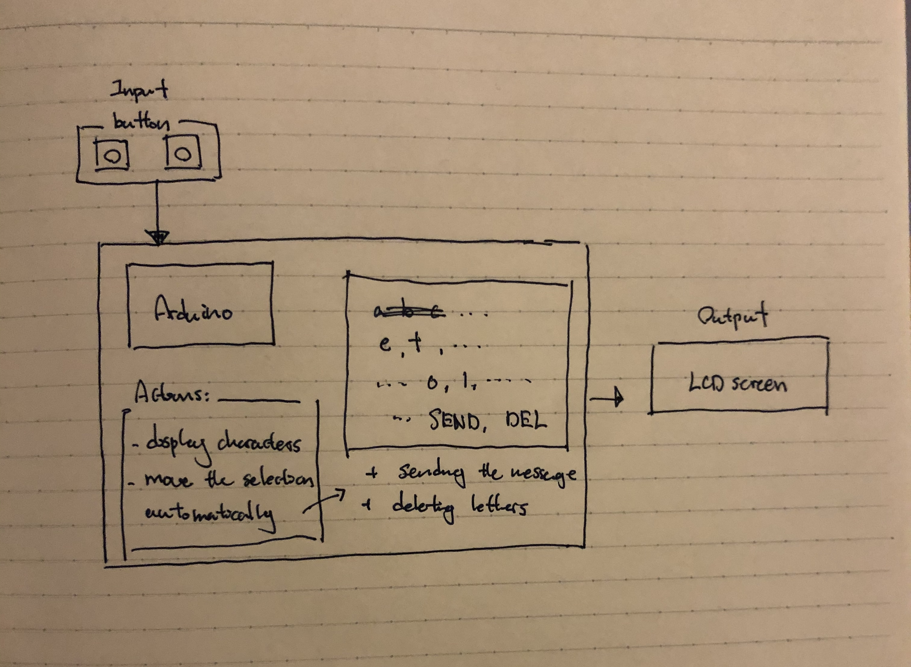

Martian Decoder
======

A program that decodes and translates, between English, morse, and binary. This program is made in arduino (modern c).

Contents
------

1. [Keywords](#keywords)
2. [Planning](#planning)
3. [Design](#design)
4. [Development](#development) 
5. [Evaulation](#evaluation)
6. [Resources](#resources)


Keywords
-----

### Binary Code
**How does binary number work?**

| A | B | C | D |             
| ---| --- | --- | --- |     
| 0 | 0 | 0 | 0 |
| 0 | 0 | 0 | 1 |
| 0 | 0 | 1 | 0 |
| 0 | 0 | 1 | 1 |
| 0 | 1 | 0 | 0 |
| 0 | 1 | 0 | 1 |
| 0 | 1 | 1 | 0 |
| 0 | 1 | 1 | 1 |
| 1 | 0 | 0 | 0 |
| 1 | 0 | 0 | 1 |
| 1 | 0 | 1 | 0 |
| 1 | 0 | 1 | 1 |
| 1 | 1 | 0 | 0 |
| 1 | 1 | 0 | 1 |
| 1 | 1 | 1 | 0 |
| 1 | 1 | 1 | 1 |

This is the table of the binary numbers from 0 to 16. From this table we observe how each digit have their own distinct pattern. In D, 0 and 1 change one by one. In other words, the pattern "01" is repeated through the whole table as you go down. In C, the pattern becomes "0011", and in B it is "00001111", and finally in A it is "0000000011111111". What is happening here is that 0 and 1 are forming some kind of pattern that are repeated as the number becomes bigger and bigger. In d, 0 and 1 are changing one by one, which gives us the total "sequence segment" number of 2. After one "01", then comes another "01". In C, it is "0011", that is repeated and the total number of 0 and 1 in this pattern is. Then in B it is 8, and in A it is 16. We can see how the number increases by the number of exponents of 2, meaning 2, 4, 8, 16,.... 

### Binary Gates
**What are binary gates?**

**Image taken from IGCSE Computer Science [1]**

### Usability
According to Interaction Design Foundation [2], usability refers to the ease of access or use of a product or a website. Furthermore the official definition by ISO 9241-11 is “the extent to which a product can be used by specified users to achieve specified goals with effectiveness, efficiency and satisfaction in a specified context of use.”

### Discoverability 
According to Techopedia [3], it "refers to users' ability to find key information, applications or services". It allows users to locate some problems, and find new needs, so that they can achieve those needs. Also according Don Norman in the video "It's not you. Bad doors are everywhere" [5] he explains about discoverability as, "When I look at something, I should be able to discover what operations I can do."

### Feedback 
According to ComputerScienceWiki [4], feedback occurs "when outputs of a system are routed back as inputs as part of a chain of cause-and-effect that forms a circuit or loop". 

### Human Centered Design (HCD)
According to the video by Joe Posner and Roman Mars [5], human centered design is the cycle of observation, ideation, prototyping and testing, then going back to observation, and starting the whole cycle again. 

Planning
------

### Opening question

**Consider the case of a challenged person, where they cannot operate a keyboard or a mouse.**

Question: What are some ways where we can provide a more accessible and simpler input for them?

Solutions: 
1. Eye-motion
2. Voice input (ex. Siri)
3. Neural input

There are more ways, but these are some other ways the users can use devices, even though they have some disabilities, and are challenged. 

### Defining the Problem

In this program "Martian Decoder", we will be mainly focusing on how, challenged or disabled users can use our program. The prompt is this: 
"The year is 2050. The new field of Planet exploration is developing exponentially, although the communication between the planets is sitll precarious. The station in the Earth can only communicate using Morse code, the station in the Moon can only communicate in Binary code.  Communication in Mars must be provided"
In short there are 3 stations in different planets (and moon), and they all have a specific way communicating: Earth & Mars - morse, Moon - binary. Because they are not compatible, we need to decode everything into English, to create a smoother communication system among the three planets. The requirements are the following: 

1. Communication of Earth - Moon: Morse code
2. Communication of Moon - Mars: Binary code
3. Provide communication system that allows stations to communicate in English 
4. Keyboard input on each stations is limited to onlt two push buttons
5. 100 lights and buzzers are avaialable

Following these requirements we need to create an appropriate program for this specific scenario.

### Who is the client?

The clients are the people who are working in Earth, and the astronauts who are working in Moon and Mars. They have many works to do and one of them is "communication". Although our clients have too many works, so we want to make at least the commnication part of their work, as simple as possible. Also especially for the astronauts, they have stayed in space for a long time, that they cannot use their hand as nimble as they used to in Earth. 


### Solution proposed

The user of this program is the astronauts who are working in the outerspace. They do have a base to work in, in every planet (and the moon), although, because of the other difficult jobs excluding communication between the planets, us, the developers needs to create a simple system for them, to make their job as lesss stressful as possible. The solution is, we can create a system, that is able to operate with only 2 buttons. In this way they don't have to so much work, but only use 2 buttons to accomplish the process from receiving a message, typing in a message, and then sending the message to the designated location.


### Success Criteria

1. The display shows every possible character the user can type in (A~Z, 0~9, space)
2. The letter blinks to indicate which letter is selected
3. The cursor is automatically moved
4. The user can select a character
5. The user can delete a character
6. The user can send the message to the designated location 
7. The other station can receive the message 
8. Earth to Moon: English -> Morse -> English (morse and english can be translated to each other)
9. Moon to Mars: English -> Binary -> English (binary and english can be translated to each other)


Design
----

### English input system


**Diagram 1**

This diagram 1 is for the english input system that we have to develop, as written in the [development](#development) section. In this system, it displays the possible characters for the users to type in, and then the selection of the letter automatiaclly moves. The alphabets are dispayed in the order of "most used", so that the user can easily recognize where the letters they want to use are. It requires several actions, including selecting the letter, deleting them, and sending the message. The input of this whole system would be the 2 buttons, to keep the operation method as easy as possible, and the output would be the lcd screen in this case, since we are using arduino kit to create the circuit.


**Diagram 2**

This flow chart indicates the code of the english input system. The code is, according to the flow diagram, seperated into 4 functions, along with the initial variables settings in the beginning. One flaw of the program is that the function orders are different. Meaning that the execution order of the function should be different. I think the setup() and loop() should go after the other two functions, since they are the ones, who are actually running the code. One problem was that, this was the first time drawing a flow chart of a code including functions, so I did not know the correct way of doing that. I drew a red line next to the diagram to indicate that these line of codes belong to this function. 


Development
-----
 
### Martian Decoder Step 1: Creating Engligh input

After doing all the previous tasks in arduino, and learning about the programming language itself, as well as the concept of binary code, binary gates, and other additional things, we are now ready to start developing the actual martion decoder program. The first step is create an english input system for the clients, since they will be typing the messages in english and sending them to other locations. To mention the requirements for this english input, they are:

1. There should be 37 characters to total, that the user can type in (alphabets x26, 0-9 x10, and space x1; 26 + 10 + 1 = 37)
2. The operation should be able with 2 buttons
3. Clients should be able to send the message to their preferred location
4. Clients should be able to delete their mistakes

By checking on these criterias, we can see how successful our english input system is.
Here are general stepsi in creating the system:

1. Ideating how the input system would work
2. Select the option, that best fits the needs of our clients
3. Create the actual program by coding 

**Step 1: Ideation**

Ideas:

1. When pushing one button the character changes one by one. When reaching last character, goes back to the first character. Then by pushing the other button, they select the letter. 
2. Displays all possible characters on the display. Then go right by pushing the first button. When reaching the last character, goes back to the first one. Push the other button to select. Push the two buttons simultaneously to send the message.
3. Same as 2, but instead the cursor moves automatically. Select the letter by one button. Also add "SEND", and "DEL", on the diplay. Then they can send and delete the messages.

There are so many more ideas that there is too much to mention all of them. These ideas would work if we tweek a little but, although we need to narrow it down to the best idea, that might be most useful to the client.

**Step 2: Class idea**

The class idea is the system diagram 1 in the [planning](#planning) section, along with a brief explanation of how it functions.

**Step 3: Coding**

```sh 
// include the library code:
#include <LiquidCrystal.h>
int index = 0; 
// add all the letters and digits to the keyboard
String keyboard[]={"A", "B", "C", "D", "E", "F", "G", "H", "I", "J", "K", "L", "M", "N", "O", "P", "Q", "R", "S", "T", "U", "V", "W", "X", "Y", "Z", " ", "0", "1", "2", "3", "4", "5", "6", "7", "8", "9", "SENT", "DEL"};
String text = "";
int numOptions = 6;

// initialize the library with the numbers of the interface pins
LiquidCrystal lcd(12, 11, 5, 4, 9, 8);

void setup() {
  // set up the LCD's number of columns and rows:
  lcd.begin(16, 2);
  // Print a message to the LCD.
  attachInterrupt(0, changeLetter, RISING);//button A in port 2
  attachInterrupt(1, selected, RISING);//button B in port 3
}

void loop() {
  // set the cursor to column 0, line 1
  // (note: line 1 is the second row, since counting begins with 0):
  lcd.clear();
  lcd.setCursor(0, 0);
  lcd.print(keyboard[index]);
  lcd.setCursor(0, 1);
  lcd.print(text);
  delay(100);
}

//This function changes the letter in the keyboard
void changeLetter(){
  static unsigned long last_interrupt_time = 0;
  unsigned long interrupt_time = millis();
  if (interrupt_time - last_interrupt_time > 200)
  {
  
    last_interrupt_time = interrupt_time;// If interrupts come faster than 200ms, assum
    index++;
      //check for the max row number
    if(index==numOptions){
      index=0; //loop back to first row
    } 
 }
}

//this function adds the letter to the text or send the msg
void selected(){
  static unsigned long last_interrupt_time = 0;
  unsigned long interrupt_time = millis();
  if (interrupt_time - last_interrupt_time > 200)
  {
  
    last_interrupt_time = interrupt_time;// If interrupts come faster than 200ms, assum
    
    String key = keyboard[index];
    if (key == "DEL")
    {
      int len = text.length();
      text.remove(len-1);
    }
    else if(key == "SENT")
    {
      text="";
    }else{
      text += key;
    }
    index = 0; //restart the index
  }
}
``` 
This is the entire code of the enlgish input system. In this code there are different parts. First is the changeLetter() function. In this function, it allows the character that is appearing on the lcd screen to change when the user presses the button. Meaning that when it is A and when the button is pressed it becomes B, and so on. And when it reaches the last character it goes back to A and start the restart the entire process. Selected() function, allows the user to delete and send the message. These functions are called in the setup function using interrupts, whc¥ich is necessary when calling one or more functions. Interrupts allows different code to be executed in the middle of the execution of other codes. This was successful and it performed exactly how we intended to. Evaluations done further in the evaluation section below. 

### Martian Decoder Step 2: Development of translation program 

The next step is to create a program that accomplishes the translation part of the Martian decoder program. From the Earth station only morse can be emitted, therefore we need to develop a program that translates the english message which the user want to send, into morse so that it can be sent to other stations. There are many things to be considerd although what needs to be considered the most the usability. How should the morse code be emmited, so that the receivers can read the message easily? There was the option of using 1 or 2 light bulbs. After discussing with the moon station, it all came down to which was easier for the reader to understand, using one light bulb and lighting up the bulb time based, or using two light bulbs and representing dots and dashes with different numbers of light bulbs? 

**Pros and cons of Time-Based Morse system**

| Pros | Cons |
| --- | --- |
| Appears to be easier to code | Maybe diffcult to differentiate with time |
| Only uses one light | Need to wait to understand what is being sent |
| More energy efficient | Slow to send the messages |

**Pros and cons of using two lights**

| Pros | Cons |
| --- | --- |
| Easier to read than time based | Might be more complicated |
| About watching | Hard to differentiate between spaces |
| Immediately know whats happening | May need to educate the users |

After considering these factors, we decided that using two lights might be a better way of sending morse as well as receiving the message. Once the user gets used to this, it would be time efficient, and also easier to read, since there will be no confusion between dots and dashes, which is one flaw of the time based system. Furthermore, it would be a big of a deal to switch the code to the other option when things do not work out as expected, because there is a lot in common between the concept of the 2 scripts. 

**Basic code**

Before going into the development of the translation program using two lights, we developed the fundamental steps that can be used for both codes:

1. Define "dot" and "dash", as well as different type of spaces (within a letter, between letters words) in seperate functios to prevent repetition of the same code
2. Blink light rapdily 5 times to indicate the start of the message 
3. Use switch case statements which looks at the letter and then translates 


### Protocols 

Protocols are the set of rules computers follow when communicating across a network. Without them, no information can be transmitted as computers don't know how to interpret the signals coming through the network. These are the different types of protocols. 

| Protocol's name | Created by | Used in |
| --- | --- | --- |
| IP (Internet Protocol) | Vint Cerf, Robert E. Kahn | Interface, identification + address in the network |
| FTP (File Transfer Protocol) | Abhay Bhusan | transferring files between client and server |
| SSH (Secure Shell) | Tatu Yloren | Log in to a remote machine and execute commands |
| SMTP (Simple Mail Transfer Protocol) | RFC 821 | Sending and receicing email |
| Telnet | UCLA | provide bidirectional interacrtive text-oriented commnication facility |
| POP3 (Post Office Protocol) | Mark Crispin | retreive email from a mail server |
| HTTP (HyperText Transfer Protocol) | Tim Berners Lee | worldwide webs (foudation of hyperlinks ex. "click here") |
| VPN (Virtual Private Network) | Gurdeep Singh-Pall | provides encrypted internet connections |
 


Evaluation 
=========

(In progress)

### Comparison of Bash & Arduino 

### 1. Bash
**Pros**

1. Less symbols (), {}, etc.
2. Very powerful
3. Quick execution speed
4. Great use for apple products / terminals
5. Easy to check errors

**Cons**

1. Very syntax specifc (single space mistake can lead to the code crashing)
2. No symbols result in confusion from time to time 
3. Syntax is very different from other programming language
4. Can only be used in terminal 

### 2. Arduino 
**Pros**

1. Alike with some other programming language 
2. Less space accuracy (even missing a space it still runs the code)
3. Can be used in a variety of platform 
4. Can use functions 

**Cons**

1. Sometimes hard to spot errors
2. Too many symbols (), {}, etc. 
3. Slow execution speed (simulation speed is way slower than bash)
4. Many different commands to remember


Resources
------

[1] IGCSE Computer Science, "Chapter 3-Logic gates and Logic Circuits", https://avyscomputerscienceblog.wordpress.com/chapter-3/, 2019/11/27

[2] Interaction Design Foundation, "Usabilty", https://www.interaction-design.org/literature/topics/usability, 2019/11/28

[3] Techopedia, "Discoverability", https://www.techopedia.com/definition/28140/discoverability-design, 2019/11/28

[4] ComputerScienceWiki, "Feedback", "https://computersciencewiki.org/index.php/Feedback", 2019/11/28

[5] Joe Posner, Roman Mars, "It's not you. Bad doors are everywhere", "https://www.youtube.com/watch?v=yY96hTb8WgI", 2019/12/03


