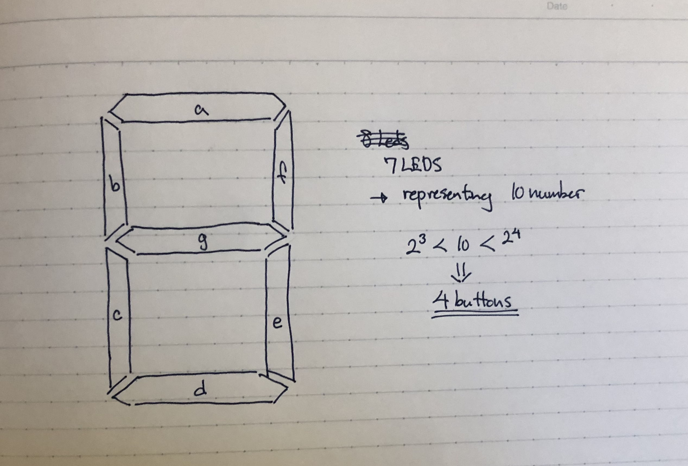

Martian Decoder
======

A program that decodes and translates, between English, morse, and binary. This program is made in arduino (modern c).

Contents
------

1. [Keywords](#keywords)
2. [Planning](#planning)
3. [Design](#design)
4. [Development](#development) 
5. [Evaulation](#evaluation)
6. [Resources](#resources)


Keywords
-----

### Binary Code
**How does binary number work?**

| A | B | C | D |             
| ---| --- | --- | --- |     
| 0 | 0 | 0 | 0 |
| 0 | 0 | 0 | 1 |
| 0 | 0 | 1 | 0 |
| 0 | 0 | 1 | 1 |
| 0 | 1 | 0 | 0 |
| 0 | 1 | 0 | 1 |
| 0 | 1 | 1 | 0 |
| 0 | 1 | 1 | 1 |
| 1 | 0 | 0 | 0 |
| 1 | 0 | 0 | 1 |
| 1 | 0 | 1 | 0 |
| 1 | 0 | 1 | 1 |
| 1 | 1 | 0 | 0 |
| 1 | 1 | 0 | 1 |
| 1 | 1 | 1 | 0 |
| 1 | 1 | 1 | 1 |

This is the table of the binary numbers from 0 to 16. From this table we observe how each digit have their own distinct pattern. In D, 0 and 1 change one by one. In other words, the pattern "01" is repeated through the whole table as you go down. In C, the pattern becomes "0011", and in B it is "00001111", and finally in A it is "0000000011111111". What is happening here is that 0 and 1 are forming some kind of pattern that are repeated as the number becomes bigger and bigger. In d, 0 and 1 are changing one by one, which gives us the total "sequence segment" number of 2. After one "01", then comes another "01". In C, it is "0011", that is repeated and the total number of 0 and 1 in this pattern is. Then in B it is 8, and in A it is 16. We can see how the number increases by the number of exponents of 2, meaning 2, 4, 8, 16,.... 

### Binary Gates
**What are binary gates?**

**Image taken from IGCSE Computer Science [1]**

### Usability
According to Interaction Design Foundation [2], usability refers to the ease of access or use of a product or a website. Furthermore the official definition by ISO 9241-11 is “the extent to which a product can be used by specified users to achieve specified goals with effectiveness, efficiency and satisfaction in a specified context of use.”

### Discoverability 
According to Techopedia [3], it "refers to users' ability to find key information, applications or services". It allows users to locate some problems, and find new needs, so that they can achieve those needs. Also according Don Norman in the video "It's not you. Bad doors are everywhere" [5] he explains about discoverability as, "When I look at something, I should be able to discover what operations I can do."

### Feedback 
According to ComputerScienceWiki [4], feedback occurs "when outputs of a system are routed back as inputs as part of a chain of cause-and-effect that forms a circuit or loop". 

### Human Centered Design (HCD)
According to the video by Joe Posner and Roman Mars [5], human centered design is the cycle of observation, ideation, prototyping and testing, then going back to observation, and starting the whole cycle again. 

Planning
------

### Opening question

**Consider the case of a challenged person, where they cannot operate a keyboard or a mouse.**

Question: What are some ways where we can provide a more accessible and simpler input for them?

Solutions: 
1. Eye-motion
2. Voice input (ex. Siri)
3. Neural input

There are more ways, but these are some other ways the users can use devices, even though they have some disabilities, and are challenged. 

### Defining the Problem

In this program "Martian Decoder", we will be mainly focusing on how, challenged or disabled users can use our program. The prompt is this: 
"The year is 2050. The new field of Planet exploration is developing exponentially, although the communication between the planets is sitll precarious. The station in the Earth can only communicate using Morse code, the station in the Moon can only communicate in Binary code.  Communication in Mars must be provided"
In short there are 3 stations in different planets (and moon), and they all have a specific way communicating: Earth & Mars - morse, Moon - binary. Because they are not compatible, we need to decode everything into English, to create a smoother communication system among the three planets. The requirements are the following: 

1. Communication of Earth - Moon: Morse code
2. Communication of Moon - Mars: Binary code
3. Provide communication system that allows stations to communicate in English 
4. Keyboard input on each stations is limited to onlt two push buttons
5. 100 lights and buzzers are avaialable

Following these requirements we need to create an appropriate program for this specific scenario.

### Who is the client?

The clients are the people who are working in Earth, and the astronauts who are working in Moon and Mars. They have many works to do and one of them is "communication". Although our clients have too many works, so we want to make at least the commnication part of their work, as simple as possible. Also especially for the astronauts, they have stayed in space for a long time, that they cannot use their hand as nimble as they used to in Earth. 


### Solution proposed

The user of this program is the astronauts who are working in the outerspace. They do have a base to work in, in every planet (and the moon), although, because of the other difficult jobs excluding communication between the planets, us, the developers needs to create a simple system for them, to make their job as lesss stressful as possible. The solution is, we can create a system, that is able to operate with only 2 buttons. In this way they don't have to so much work, but only use 2 buttons to accomplish the process from receiving a message, typing in a message, and then sending the message to the designated location.

### Success Criteria

1. The display shows every possible character the user can type in (A~Z, 0~9, space)
2. The letter blinks to indicate which letter is selected
3. The cursor is automatically moved
4. The user can select a character
5. The user can delete a character
6. The user can send the message to the designated location 
7. The other station can receive the message 
8. Earth to Moon: English -> Morse -> English (morse and english can be translated to each other)
9. Moon to Mars: English -> Binary -> English (binary and english can be translated to each other)


Design
----

Development
-----

### 1.Traffic Light Program

This is the virtual circuit of the program:


The following is the actual code of te¥his program:

```sh 
// assigning integer for each leds (same number as the arduino input)
int redLight = 13; 
int yellowLight = 12;
int greenLight = 11;

void setup() {
  // the code would only run once
  // setup of which sources are the input and output
  pinMode(redLight, OUTPUT);
  pinMode(yellowLight, OUTPUT);
  pinMode(greenLight, OUTPUT); 
}

void loop() {
  // the code would run repeatedly
  // Calling out the function below, by assigning the arguments
  blinkColor(1000, redLight);
  blinkColor(1000, yellowLight);
  blinkColor(1000, greenLight);
}

// Parameters to reuse them
void blinkColor(int t, int color) {
  // parameters specified in the above loop function
  digitalWrite(color, HIGH);
  delay(t);
  digitalWrite(color, LOW);
  delay(t);
}
```

This code simply turns on the red led first, and then after 1 second, it turns on yellow light, and turn off the red, then after another second, does the same process but with green color. By calling out the blinkColor in the loop function, it runs infinitely until we stop the simulation. By using parameters in the blinkColor function, we can set different arguments in the same fucntion, in other words, reuse the same function but for another purpose. HIGH, means turn on, and LOW means turn off in arduino, and this appears a lot so it is better if we remember this.


### Binary lights

This program should light the leds in 15 different ways by using the binary numbers.
Steps: 
1. Create 4 leds (Each representing the digits of binary numbers)
2. Create a for loop that counts until 15 
3. For each count convert decimal to binary using module(%)
4. If statements to assign when count%x is y then light the designated leds

```sh 
// Assiging the input numbers in the arudino board
int redLight = 13;
int blueLight = 12;
int yellowLight = 11;
int whiteLight = 10;

void setup() {
  pinMode(13, OUTPUT);
  pinMode(12, OUTPUT);
  pinMode(11, OUTPUT);
  pinMode(10, OUTPUT);
}

void loop() {
  // Calling the function 
  countBinary();
}

void countBinary() {
  for (int count=0; count<=15; count++) {
    //led D
    if (count%2 == 1) {
      digitalWrite(whiteLight, HIGH);
    } else {
      digitalWrite(whiteLight, LOW);
    }
    //led C
    if (count%4 > 1) {
      digitalWrite(yellowLight, HIGH);
    } else {
      digitalWrite(yellowLight, LOW);
    }
    //led B
    if (count%8 > 3) {
      digitalWrite(blueLight, HIGH); 
    } else {
      digitalWrite(blueLight, LOW);
    }
    //led A
    if (count%16 > 7) {
      digitalWrite(redLight, HIGH);
    } else {
      digitalWrite(redLight, LOW);
    }
    delay(1000);
  }
  
}
```
The outcome is that the 4 lights represent each digit in hte binary numbers, and that when the digit number is 1, then it turns on the light, when it is 0 then otherwise. In this program this is what is happening:

| Decimal | digit C | decimal%4 |
| --- | --- | --- |
| 1 | 0 | 0 |
| 2 | 0 | 1 |
| 3 | 1 | 2 | 
| 4 | 1 | 3 |
| 5 | 0 | 0 |
| 6 | 0 | 1 |
| 7 | 1 | 2 |

In this table we can see, how when the decimal%4 becomes bigger than 1, then C is 1. Therefore the code: 
```sh 
if (count%4 > 1) {
  digitalWrite(yellowLight, HIGH);
}
```
since the 1 means HIGH. The code works like this, and by representing each leds as digits A, B, C, D of binary numbers, we can light the 4 leds in 15 different ways, using the concept of binary numbers.

This is the product:


### Development of Weekend Task

**Table 1:**

| butA | butB | out1 | out2 |
| --- | --- | --- | --- |
| 0 | 0 | 1 | 0 |
| 0 | 1 | 0 | 1 |
| 1 | 0 | 1 | 1 |
| 1 | 1 | 0 | 0 |

Step: 
1. Create variable for all inputs and outputs
2. Create if statements saying "if these inputs are on, and turn on these inputs"

```sh 
int butA = 13;
int butB = 12;
int out1 = 3;
int out2 = 4;

void setup() {
  pinMode(butA, INPUT);
  pinMode(butB, INPUT);
  pinMode(out1, OUTPUT);
  pinMode(out2, OUTPUT);
}

void loop() {
  if (digitalRead(butA)==LOW && digitalRead(butB)==LOW) {
    digitalWrite(out1, HIGH);
    digitalWrite(out2, LOW);
  } else if (digitalRead(butA)==LOW && digitalRead(butB)==HIGH) {
    digitalWrite(out1, LOW);
    digitalWrite(out2, HIGH);
  } else if {digitalRead(butA)==HIGH && digitalRead(butB)==LOW) {
    digitalWrite(out1, HIGH);
    digitalWrite(out2, HIGH);
   } else if (digitalRead(butA)==HIGH && digitalRead(butB)==HIGH) {
    digitalWrite(out1, LOW);
    digitalWrite(out2, LOW);
  }
}
```
This code is using conditional statements to decide on which output is HIGH and LOW, depending on which input is HIGH and LOW.
This is how the circuit would look like: 


**Table 2:**


| butA | butB | out1 | out2 |
| --- | --- | --- | --- |
| 0 | 0 | 1 | 0 |
| 0 | 1 | 0 | 1 |
| 1 | 0 | 0 | 1 |
| 1 | 1 | 1 | 1 |

The condition slightly changes, although the whole structure of the code is exactly the same. 
```sh 
int butA = 13;
int butB = 12;
int out1 = 3;
int out2 = 4;

void setup() {
  pinMode(butA, INPUT);
  pinMode(butB, INPUT);
  pinMode(out1, OUTPUT);
  pinMode(out2, OUTPUT);
}

void loop() {
  if (digitalRead(butA)==LOW && digitalRead(butB)==LOW) {
    digitalWrite(out1, HIGH);
    digitalWrite(out2, LOW);
  } else if (digitalRead(butA)==LOW && digitalRead(butB)==HIGH) {
    digitalWrite(out1, LOW);
    digitalWrite(out2, HIGH);
  } else if {digitalRead(butA)==HIGH && digitalRead(butB)==LOW) {
    digitalWrite(out1, LOW);
    digitalWrite(out2, HIGH);
   } else if (digitalRead(butA)==HIGH && digitalRead(butB)==HIGH) {
    digitalWrite(out1, HIGH);
    digitalWrite(out2, HIGH);
  }
}
```

**Table 3**


| butA | butB | but C | out1 | out2 |
| --- | --- | --- | --- | --- | 
| 0 | 0 | 0 | 1 | 1 | 
| 0 | 0 | 1 | 1 | 1 | 
| 0 | 1 | 0 | 1 | 0 | 
| 0 | 1 | 1 | 1 | 0 | 
| 1 | 0 | 0 | 0 | 1 | 
| 1 | 0 | 1 | 1 | 1 | 
| 1 | 1 | 0 | 1 | 1 | 
| 1 | 1 | 1 | 1 | 1 | 

This table is different from the last 2 tables, but the only difference is that there is one more input. Therefore there are more combinations of the buttons, and this mean that there will be more if statements in the code, although the structure is the same again, even for table 3.

```sh 
int butA = 13;
int butB = 12;
int butC = 11;
int out1 = 3;
int out2 = 4;

void setup() {
  pinMode(butA, INPUT);
  pinMode(butB, INPUT);
  pinMode(butC, INPUT);
  pinMode(out1, OUTPUT);
  pinMode(out2, OUTPUT);
}

void loop() {
  if (digitalRead(butA)==LOW && digitalRead(butB)==LOW && digitalRead(butC)==LOW) {
    digitalWrite(out1, HIGH);
    digitalWrite(out2, HIGH);
  } else if (digitalRead(butA)==LOW && digitalRead(butB)==LOW && digitalRead(butC)==HIGH) {
    digitalWrite(out1, HIGH);
    digitalWrite(out2, HIGH);
  } else if (digitalRead(butA)==LOW && digitalRead(butB)==HIGH && digitalRead(butC)==LOW) {
    digitalWrite(out1, HIGH);
    digitalWrite(out2, LOW);
  } else if (digitalRead(butA)==LOW && digitalRead(butB)==HIGH && digitalRead(butC)==HIGH) {
    digitalWrite(out1, HIGH);
    digitalWrite(out2, LOW);
  } else if (digitalRead(butA)==HIGH && digitalRead(butB)==LOW && digitalRead(butC)==LOW) {
    digitalWrite(out1, LOW);
    digitalWrite(out2, HIGH);
  } else if (digitalRead(butA)==HIGH && digitalRead(butB)==LOW && digitalRead(butC)==HIGH) {
    digitalWrite(out1, HIGH);
    digitalWrite(out2, HIGH);
  } else if (digitalRead(butA)==HIGH && digitalRead(butB)==HIGH && digitalRead(butC)==LOW) {
    digitalWrite(out1, HIGH);
    digitalWrite(out2, HIGH);
  } else {
    digitalWrite(out1, HIGH);
    digitalWrite(out2, HIGH);
  }
}
```

In this program the code becomes very long, but essentially we are doing the same thing in table 1 and 2, but with a lnger process, since there is one more input to consider.

### 4. Using Binary Gates for Weekend Task
**Table 1**

Using the same table as before, we are going to another code that performs exactly the same thing, but with a different method. By using binary gates. This is table for the first output.

| b\a | 0 | 1 |
| --- | --- | --- |
| 0 | 1 | 1 |
| 1 | 0 | 0 | 

What we can observe here is that, the light turns on (becomes 1) when the button a and b are both 0 and, when button a is 1 and b is 0. These are the 2 scenarios that the led out1 turns on. Therefore, by using the concept of binary gates, we can come up with the equation `NOT B`. When "Not B", out1 turns on. Now that we sorted out out1, we also need to think about out2. 

| b\a | 0 | 1 |
| --- | --- | --- |
| 0 | 0 | 1 |
| 1 | 1 | 0 |

This is the table for out2. The equation for when the out2 turns on is `(NOT A) AND B OR A AND (NOT B)`. Therefore, the  previous code can be modified as in the following: 

```sh 
int butA = 13;
int butB = 12;
int out1 = 3;
int out2 = 4;

void setup() {
  pinMode(butA, INPUT);
  pinMode(butB, INPUT);
  pinMode(out1, OUTPUT);
  pinMode(out2, OUTPUT);
}

void loop() {
  bool A = digitalRead(butA);
  bool B = digitalRead(butB);
  
  bool eq1 = !B;
  bool eq2 = !A & B | !B & A;
  
  digitalWrite(out1, eq1);
  digitalWrite(out2, eq2);
}
```

By using binary gates the code becomes a lot more concise, and still it does the exact same thing. 

**Table2**
This is essentially the same step: 
1. Create a table for both out1 and out2
2. Then come up with equations for each output using binary gates
Firstly, this is the table for out1:

| b\a | 0 | 1 |
| --- | --- | --- |
| 0 | 1 | 0 |
| 1 | 0 | 1 |

Then by looking at the table, we can find the equation for when out1 turn on. In this case it is
`(NOT A AND NOT B) OR (A AND B)`. For the out2, this is the table: 

| b\a | 0 | 1 |
| --- | --- | --- |
| 0 | 0 | 1 |
| 1 | 1 | 1 |

In this other case, we can come up with the equation `A OR B`. Using these tables and binary gates equations, we can come with the following code: 
```sh 
int butA = 13;
int butB = 12;
int out1 = 3;
int out2 = 4;

void setup() {
  pinMode(butA, INPUT);
  pinMode(butB, INPUT);
  pinMode(out1, OUTPUT);
  pinMode(out2, OUTPUT);
}

void loop() {
  bool A = digitalRead(butA);
  bool B = digitalRead(butB);
  
  bool eq1 = !A & !B | A & B;
  bool eq2 = A | B;
  
  digitalWrite(out1, eq1);
  digitalWrite(out2, eq2);
}
```

This is the modified code. As mentioned before, it does the exact same performance.

**Table 3**
The same step is taken in this one, but with one more input. The table would be like this below.

Table for out1: 

| c\ab | 00 | 01 | 11 | 10 |
| --- | --- | --- | --- | --- |
| 0 | 1 | 1 | 1 | 0 |
| 1 | 1 | 1 | 1 | 1 | 

Table for out2: 

| c\ab | 00 | 01 | 11 | 10 |
| --- | --- | --- | --- | --- |
| 0 | 1 | 0 | 1 | 1 |
| 1 | 1 | 0 | 1 | 1 | 

Then we find the equation that best fits the conditions in the table, using bunary gates.

Equation for out1: `NOT A OR B OR C`

Equation for out2: `NOT A AND NOT B OR A`

This is code for table 3: 

```sh 
int butA = 13;
int butB = 12;
int butC = 11;
int out1 = 3;
int out2 = 4;

void setup() {
  pinMode(butA, INPUT);
  pinMode(butB, INPUT);
  pinMode(butC, INPUT);
  pinMode(out1, OUTPUT);
  pinMode(out2, OUTPUT);
}

void loop() {
  bool A = digitalRead(butA);
  bool B = digitalRead(butB);
  bool C = digitalRead(butC);
  
  bool eq1 = !A | B | C;
  bool eq2 = !A & !B | A;
  
  digitalWrite(out1, eq1);
  digitalWrite(out2, eq2);
}
```

This should essentially perform the same thing with the previous code, with long for loops. In conclusion, by using binary gates, it allows us to make the code more simple and line efficient. 


### Development of the digital number led program 

For this program we needed to create this using the concept of binary and binary gates:


Step 1: Create a diagram of the leds and decide how many buttons we need 

**Fig.1**

This figure 1 shows the diagram of how the digital numbers are structured. There are 7 leds, and using those leds, it should represent 0~9, which is 10 numbers. The mathematical operation shows that 10 is bigger than 2 to the power of 3 but smaller than 2 to the power of 4, indicating that we need 4 buttons which can represent each digit in binary, since we need 4 digits to represent 10 numbers in binary. 

Step 2: Create a virtual circuit in tinkercad.com

**Fig.2**

Figure 2 shows the intial circuit that I created. There are four buttons each associated with one resistor. Also there are many leds in the right. When talking a closer look at the leds, you may see how the 2-3 leds are connected together. The horizontally alligned leds are 3 in 1, and vertical ones are 2 in 1. I did this to make the result easier to see, so we can observe what is working and not.

Step 3: Draw a table for the buttons

**Fig.3**

In figure 3, 0 represents off, and 1 is on. Depending on which number to show on the leds, the buttons that needs to be pushed will change. This table shows that for example, to show 6 with the leds you need to turn on buttons B and C. Also for the leds, the led f is the only one that is turned off. Like this, in the table there is the information, for all of the numbers.

Step 4: Draw a table for each leds 

**Fig.4**

In this figure, I tried to create a table for each leds, so that I can see the pattern of when and when not the leds are on. By doing this, we can move on to the next step, which makes are code line efficient, and therefore easier to read.

Step 5: Write down the eqaution (using binary gates) for every led

**Fig.5**

Figure 5 shows the same drawing of the table, but I've done here is I showed the process of coming up with equations using binary gates. By using binary gates, as also mentioned above, it makes the code much more concise, and easier to see. Thus, for example, when there is an error in the program, it would be easier to locate the mistakes in the code, since there are less possible areas that error can occur. You don't need to scroll down the code, because the code is short enough to locate the error with one glance.

And finally this is the code for the entire program that I came up with:
```sh
int butA = 13;
int butB = 12;
int butC = 11;
int butD = 10;
int ledA = 7;
int ledB = 6;
int ledC = 5;
int ledD = 4;
int ledE = 3;
int ledF = 2;
int ledG = 1;

void setup()
{
  pinMode(butA, OUTPUT);
  pinMode(butB, OUTPUT);
  pinMode(butC, OUTPUT);
  pinMode(butD, OUTPUT);
  pinMode(ledA, INPUT);
  pinMode(ledB, INPUT);
  pinMode(ledC, INPUT);
  pinMode(ledD, INPUT);
  pinMode(ledE, INPUT);
  pinMode(ledF, INPUT);
  pinMode(ledG, INPUT);
}

void loop()
{
  bool a = digitalRead(butA);
  bool b = digitalRead(butB);
  bool c = digitalRead(butC);
  bool d = digitalRead(butD);
  
  bool eqA = (!a & !b & !c & !d) | (!a & b & !c & d) | (!a & c) | (a & !b & !c);
  bool eqB = (!a & c & d) | (!a & b) | (a & !b & !c);
  bool eqC = (!a & !b & !c & !d) | (a & !b & !c & !d) | (!a & !b & !c);
  bool eqD = (!a & !b & !c & !d) | (!a & b & !c & !d) | (!a & !b & c) | (!a & c & !d) | (a & !b);
  bool eqE = (!a & !c) | (!a & d) | (!a & b & c) | (a & !b & !c);
  bool eqF = (!a & !b) | (!a & !c & !d) | (!a & c & d) | (a & !b & !c);
  bool eqG = (!a & b & !c) | (!a & !b & c) | (!a & c & !d) | (a & !b & !c);
  
  digitalWrite(ledA, eqA);
  digitalWrite(ledB, eqB);
  digitalWrite(ledC, eqC);
  digitalWrite(ledD, eqD);
  digitalWrite(ledE, eqE);
  digitalWrite(ledF, eqF);
  digitalWrite(ledG, eqG);
}
```
 This is the final product, and I checked on the simulator to see if shows the numbers in the way I expected.
 
 **Fig6**
 Figure 6 shows the issue of the prototype. One problem was that the leds were very dark although they were on. The reason I thought wsa because of how several leds were connected together. This is why I moderated the circuit so that there is only one led connected to each input. Although this didn't change the issue. The led was still dark. This meant that there was another reason that was contributing to the dimness of the led. The real reason was in the code. 
 ```sh 
 void setup()
{
  pinMode(butA, OUTPUT);
  pinMode(butB, OUTPUT);
  pinMode(butC, OUTPUT);
  pinMode(butD, OUTPUT);
  pinMode(ledA, INPUT);
  pinMode(ledB, INPUT);
  pinMode(ledC, INPUT);
  pinMode(ledD, INPUT);
  pinMode(ledE, INPUT);
  pinMode(ledF, INPUT);
  pinMode(ledG, INPUT);
}
```
For the setup, buttons should be the inputs and the leds must be the outputs. Thus the correct code should instead be the following: 
```sh 
  pinMode(butA, INPUT);
  pinMode(butB, INPUT);
  pinMode(butC, INPUT);
  pinMode(butD, INPUT);
  pinMode(ledA, OUTPUT);
  pinMode(ledB, OUTPUT);
  pinMode(ledC, OUTPUT);
  pinMode(ledD, OUTPUT);
  pinMode(ledE, OUTPUT);
  pinMode(ledF, OUTPUT);
  pinMode(ledG, OUTPUT);
 ```
 Then I carried out the second test to see the circuit works, and this is the result:
 
 
 


Evaluation 
=========

### Comparison of Bash & Arduino 

### 1. Bash
**Pros**

1. Less symbols (), {}, etc.
2. Very powerful
3. Quick execution speed
4. Great use for apple products / terminals
5. Easy to check errors

**Cons**

1. Very syntax specifc (single space mistake can lead to the code crashing)
2. No symbols result in confusion from time to time 
3. Syntax is very different from other programming language
4. Can only be used in terminal 

### 2. Arduino 
**Pros**

1. Alike with some other programming language 
2. Less space accuracy (even missing a space it still runs the code)
3. Can be used in a variety of platform 
4. Can use functions 

**Cons**
1. Sometimes hard to spot errors
2. Too many symbols (), {}, etc. 
3. Slow execution speed (simulation speed is way slower than bash)
4. Many different commands to remember


Resources
------

[1] IGCSE Computer Science, "Chapter 3-Logic gates and Logic Circuits", https://avyscomputerscienceblog.wordpress.com/chapter-3/, 2019/11/27

[2] Interaction Design Foundation, "Usabilty", https://www.interaction-design.org/literature/topics/usability, 2019/11/28

[3] Techopedia, "Discoverability", https://www.techopedia.com/definition/28140/discoverability-design, 2019/11/28

[4] ComputerScienceWiki, "Feedback", "https://computersciencewiki.org/index.php/Feedback", 2019/11/28

[5] Joe Posner, Roman Mars, "It's not you. Bad doors are everywhere", "https://www.youtube.com/watch?v=yY96hTb8WgI", 2019/12/03


