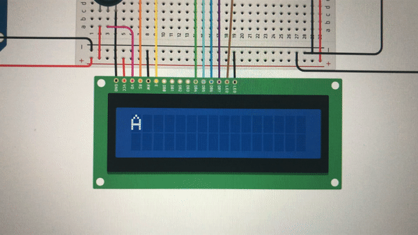

Martian Decoder
======

A program that decodes and translates, between English, morse, and binary. This program is made in arduino (modern c).

Contents
------

1. [Keywords](#keywords)
2. [Planning](#planning)
3. [Design](#design)
4. [Development](#development) 
5. [Evaulation](#evaluation)
6. [Resources](#resources)


Keywords
-----

### Binary Code
**How does binary number work?**

| A | B | C | D |             
| ---| --- | --- | --- |     
| 0 | 0 | 0 | 0 |
| 0 | 0 | 0 | 1 |
| 0 | 0 | 1 | 0 |
| 0 | 0 | 1 | 1 |
| 0 | 1 | 0 | 0 |
| 0 | 1 | 0 | 1 |
| 0 | 1 | 1 | 0 |
| 0 | 1 | 1 | 1 |
| 1 | 0 | 0 | 0 |
| 1 | 0 | 0 | 1 |
| 1 | 0 | 1 | 0 |
| 1 | 0 | 1 | 1 |
| 1 | 1 | 0 | 0 |
| 1 | 1 | 0 | 1 |
| 1 | 1 | 1 | 0 |
| 1 | 1 | 1 | 1 |

This is the table of the binary numbers from 0 to 16. From this table we observe how each digit have their own distinct pattern. In D, 0 and 1 change one by one. In other words, the pattern "01" is repeated through the whole table as you go down. In C, the pattern becomes "0011", and in B it is "00001111", and finally in A it is "0000000011111111". What is happening here is that 0 and 1 are forming some kind of pattern that are repeated as the number becomes bigger and bigger. In d, 0 and 1 are changing one by one, which gives us the total "sequence segment" number of 2. After one "01", then comes another "01". In C, it is "0011", that is repeated and the total number of 0 and 1 in this pattern is. Then in B it is 8, and in A it is 16. We can see how the number increases by the number of exponents of 2, meaning 2, 4, 8, 16,.... 

### Binary Gates
**What are binary gates?**

**Image taken from IGCSE Computer Science [1]**

### Usability
According to Interaction Design Foundation [2], usability refers to the ease of access or use of a product or a website. Furthermore the official definition by ISO 9241-11 is “the extent to which a product can be used by specified users to achieve specified goals with effectiveness, efficiency and satisfaction in a specified context of use.”

### Discoverability 
According to Techopedia [3], it "refers to users' ability to find key information, applications or services". It allows users to locate some problems, and find new needs, so that they can achieve those needs. Also according Don Norman in the video "It's not you. Bad doors are everywhere" [5] he explains about discoverability as, "When I look at something, I should be able to discover what operations I can do."

### Feedback 
According to ComputerScienceWiki [4], feedback occurs "when outputs of a system are routed back as inputs as part of a chain of cause-and-effect that forms a circuit or loop". 

### Human Centered Design (HCD)
According to the video by Joe Posner and Roman Mars [5], human centered design is the cycle of observation, ideation, prototyping and testing, then going back to observation, and starting the whole cycle again. 

Planning
------

### Opening question

**Consider the case of a challenged person, where they cannot operate a keyboard or a mouse.**

Question: What are some ways where we can provide a more accessible and simpler input for them?

Solutions: 
1. Eye-motion
2. Voice input (ex. Siri)
3. Neural input

There are more ways, but these are some other ways the users can use devices, even though they have some disabilities, and are challenged. 

### Defining the Problem

In this program "Martian Decoder", we will be mainly focusing on how, challenged or disabled users can use our program. The prompt is this: 
"The year is 2050. The new field of Planet exploration is developing exponentially, although the communication between the planets is still precarious. The station in the Earth can only communicate using Morse code, the station in the Moon can only communicate in Binary code.  Communication in Mars must be provided"
In short there are 3 stations in different planets (and moon), and they all have a specific way communicating: Earth & Mars - morse, Moon - binary. Because they are not compatible, we need to decode everything into English, to create a smoother communication system among the three planets. The requirements are the following: 

1. Communication of Earth - Moon: Morse code
2. Communication of Moon - Mars: Binary code
3. Provide communication system that allows stations to communicate in English 
4. Keyboard input on each stations is limited to onlt two push buttons
5. 100w lights and buzzers are avaialable

Following these requirements we need to create an appropriate program for this specific scenario.

### Who is the client?

The clients are the people who are working in Earth, and the astronauts who are working in Moon and Mars. They have many works to do and one of them is "communication". Although our clients have too much work such as various extraterrestrial researches,  so we want to make at least the commnication part of their work, as simple as possible. Also especially for the astronauts, they have stayed in space for a long time, that they cannot use their hand as nimble as they used to in Earth. In space their fingers usually expand, as compared to normal air pressure, therefore increasing the need for an easy input system for the users. 

### Solution proposed (For Earth station)

The solution is to create a system that can be manipulated by only 2 buttons. With the 2 buttons it should be able to perform the following things: 
1. Change the characters on the display 
2. Select the character 
3. Delete the character
4. Send the message in morse
5. Receive the message in english 

All these should be able to be manipulated by just 2 buttons. In this way, although it might take time for the user to get used to the system, once they become familiar with this new system, they will be able to communicate through planets with ease and simplicity. 

### Success Criteria (For Earth station)

1. The display shows every possible alphabet the user can type in
2. The character changes one by one, when button 1 is pressed
3. The character is selected when button 2 is pressed 
4. When the character is selected by the user, the message is updated
5. The user can delete the message character by character
6. When SEND option is activated, it successfully translates english to morse, and delete the message on the display 
7. The light bulbs work 
8. The message in morse is able to be received by users successfully without misinterpretation
9. When MORSE option is selected, it displays new options on the display (".-", "-...", .... ," ", "DEL", "RESET")
10. Button 1 changes the options
11. Button 2 selects the option
12. The message is diplayed and when "RECEIVE" is selected, it successfully tranlsates the message from morse to english 

### Justification of the tool

Throughout the whole process, we will be using the programming language: Arduino C. Since we need to test the program physically, an actual circuit was necessary, therefore Arduino C is the by far the most suitable programming language that we can use to test the program physically. Hence the circuit was created by using the Arduino UNO. This best fits with the programming language that we use. Also to test it virtually on computer, we used a software called Tinkercad. This also using the language arduino c, and we use this tool and test the code, before we actually try it out with the physical Arudino UNO. Virtual testing requires less effort and time, so we use this to get the code working correctly, and then finally testing it out on the real one. 

Design
----

### System diagram


This is the over all flow of the program. There are 3 stations including earth, moon, and mars. They have a specific code that they can use to communicate. From Earth to Mars, the communication can be done because of the moon station converting morse to binary. 

### English Input System


This flow chart indicates the code of the english input system. The code is, according to the flow diagram, seperated into 4 functions, along with the initial variables settings in the beginning. One flaw of the program is that the function orders are different. Meaning that the execution order of the function should be different. I think the setup() and loop() should go after the other two functions, since they are the ones, who are actually running the code. One problem was that, this was the first time drawing a flow chart of a code including functions, so I did not know the correct way of doing that. I drew a red line next to the diagram to indicate that these line of codes belong to this function. 

**English -> Morse translation system**

**Morse -> English translation system**


Development
-----
 
### Martian Decoder Step 1: Creating English input

After doing all the previous tasks in arduino, and learning about the programming language itself, as well as the concept of binary code, binary gates, and other additional things, we are now ready to start developing the actual martion decoder program. The first step is create an english input system for the clients, since they will be typing the messages in english and sending them to other locations. To mention the requirements for this english input, they are:

1. There should be 37 characters to total, that the user can type in (alphabets x26, 0-9 x10, and space x1; 26 + 10 + 1 = 37)
2. The operation should be able with 2 buttons
3. Clients should be able to send the message to their preferred location
4. Clients should be able to delete their mistakes

By checking on these criterias, we can see how successful our english input system is.
Here are general stepsiin creating the system:

1. Ideating how the input system would work
2. Select the option, that best fits the needs of our clients
3. Create the actual program by coding 

**Step 1: Ideation**

Ideas:

1. When pushing one button the character changes one by one. When reaching last character, goes back to the first character. Then by pushing the other button, they select the letter. 
2. Displays all possible characters on the display. Then go right by pushing the first button. When reaching the last character, goes back to the first one. Push the other button to select. Push the two buttons simultaneously to send the message.
3. Same as 2, but instead the cursor moves automatically. Select the letter by one button. Also add "SEND", and "DEL", on the diplay. Then they can send and delete the messages.

There are so many more ideas that there is too much to mention all of them. These ideas would work if we tweek a little but, although we need to narrow it down to the best idea, that might be most useful to the client.

**Step 2: Class idea**

The class idea is the system diagram 1 in the [planning](#planning) section, along with a brief explanation of how it functions.

**Step 3: Coding**

```sh 
// include the library code:
#include <LiquidCrystal.h>
int index = 0; 
// add all the letters and digits to the keyboard
String keyboard[]={"A", "B", "C", "D", "E", "F", "G", "H", "I", "J", "K", "L", "M", "N", "O", "P", "Q", "R", "S", "T", "U", "V", "W", "X", "Y", "Z", "SENT", "DEL"};
String text = "";
int numOptions = 28;

// initialize the library with the numbers of the interface pins
LiquidCrystal lcd(12, 11, 5, 4, 9, 8);

void setup() {
  // set up the LCD's number of columns and rows:
  lcd.begin(16, 2);
  // Print a message to the LCD.
  attachInterrupt(0, changeLetter, RISING);//button A in port 2
  attachInterrupt(1, selected, RISING);//button B in port 3
}

void loop() {
  // set the cursor to column 0, line 1
  // (note: line 1 is the second row, since counting begins with 0):
  lcd.clear();
  lcd.setCursor(0, 0);
  lcd.print(keyboard[index]);
  lcd.setCursor(0, 1);
  lcd.print(text);
  delay(100);
}

//This function changes the letter in the keyboard
void changeLetter(){
  static unsigned long last_interrupt_time = 0;
  unsigned long interrupt_time = millis();
  if (interrupt_time - last_interrupt_time > 200)
  {
  
    last_interrupt_time = interrupt_time;// If interrupts come faster than 200ms, assum
    index++;
      //check for the max row number
    if(index==numOptions){
      index=0; //loop back to first row
    } 
 }
}

//this function adds the letter to the text or send the msg
void selected(){
  static unsigned long last_interrupt_time = 0;
  unsigned long interrupt_time = millis();
  if (interrupt_time - last_interrupt_time > 200)
  {
  
    last_interrupt_time = interrupt_time;// If interrupts come faster than 200ms, assum
    
    String key = keyboard[index];
    if (key == "DEL")
    {
      int len = text.length();
      text.remove(len-1);
    }
    else if(key == "SENT")
    {
      text="";
    }else{
      text += key;
    }
    index = 0; //restart the index
  }
  
  
  //
}
 
``` 
This is the entire code of the enlgish input system. In this code there are different parts. First is the changeLetter() function. In this function, it allows the character that is appearing on the lcd screen to change when the user presses the button. Meaning that when it is A and when the button is pressed it becomes B, and so on. And when it reaches the last character it goes back to A and start the restart the entire process. Selected() function, allows the user to delete and send the message. These functions are called in the setup function using interrupts, whc¥ich is necessary when calling one or more functions. Interrupts allows different code to be executed in the middle of the execution of other codes. This was successful and it performed exactly how we intended to. Evaluations done further in the [evaluation](#evaluation) section below. 

### Martian Decoder Step 2: English to Morse translation

The next step is to create a program that accomplishes the translation part of the Martian decoder program. From the Earth station only morse can be emitted, therefore we need to develop a program that translates the english message which the user want to send, into morse so that it can be sent to other stations. There are many things to be considerd although what needs to be considered the most the usability. How should the morse code be emmited, so that the receivers can read the message easily? There was the option of using 1 or 2 light bulbs. After discussing with the moon station, it all came down to which was easier for the reader to understand, using one light bulb and lighting up the bulb time based, or using two light bulbs and representing dots and dashes with different numbers of light bulbs? 

**Pros and cons of Time-Based Morse system**

| Pros | Cons |
| --- | --- |
| Appears to be easier to code | Maybe diffcult to differentiate with time |
| Only uses one light | Need to wait to understand what is being sent |
| More energy efficient | Slow to send the messages |

**Pros and cons of using two lights**

| Pros | Cons |
| --- | --- |
| Easier to read than time based | Might be more complicated |
| About watching | Hard to differentiate between spaces |
| Immediately know whats happening | May need to educate the users |

After considering these factors, we decided that using two lights might be a better way of sending morse as well as receiving the message. Once the user gets used to this, it would be more time efficient and easier to read since there will be no confusion between dots and dashes, which is one flaw of the time based system. Furthermore, it would not be a big of a deal to switch the code to the other option when things do not work out as expected, because there is a lot in common between the concept of the 2 scripts. 

**Basic code**

Before going into the development of the translation program using two lights, we developed the fundamental steps that can be used for both codes:

1. Define "dot" and "dash", as well as different type of spaces (within a letter, between letters words) in seperate functions 
2. Blink light rapdily 5 times to indicate the start of the message 
3. Use case switch statements (ex. case A, switch dot(), dash()...)

**Prototype of using two lights**

First in the setup code we added new lines: 
```sh 
void setup() {
  Serial.begin(9600);
  pinMode(13, OUTPUT);
  pinMode(10, OUTPUT);
  // set up the LCD's number of columns and rows:
  lcd.begin(16, 2);
  // Print a message to the LCD.
  attachInterrupt(0, changeLetter, RISING);//button A in port 2
  attachInterrupt(1, selected, RISING);//button B in port 3
}
```
This pinMode is declaring what is the input, ouput and, which port is it connected to. In this case they are both ouputs because the leds will be acting accordingly to the input that the user gives. 

```sh 
void sent() {
  Serial.print("begin ");
  for (int i = 0; i  < 7; i++) { // blink light seven times to indicate beginning of message
    digitalWrite(13, HIGH);
    delay(300);
    digitalWrite(13, LOW);
    delay(300);
  }
  // case statements for translation
}
    
```
We created a function called sent, which tells the leds to blink 7 rapid times, to indicate the start and finish of the message. We used a for loop to do this. We also added the Serial.print command, just for us, the developers to see if the code is working. Then this is the second part of the code.

```sh     
void dot() {  // defining the dot function as one light being ON for one second 
  Serial.print("dot ");
  digitalWrite(13, HIGH);
  delay(1000);
  digitalWrite(13, LOW);
  delay(1000);
}

void dash() { // defining the dash function as the light being on for three seconds
  Serial.print("dash ");
  digitalWrite(13, HIGH);
  digitalWrite(10, HIGH);
  delay(3000);
  digitalWrite(13, LOW);
  digitalWrite(10, LOW);
  delay(1000);
}

void wait() { // defining the wait function 
  delay(2000); // between letters is two second delay
} 
```

We defined dots, dashes and spaces beforehand so that we don't have to type, for example:
```sh 
switch (text) {
  case A:
    digitalWrite(13, HIGH);
    // some more codes using delay and digitalWrite
}
```

Because we have already defined how dot, dash, space should be represented, we can now do this to create the rest of code.
```sh 
// setting len to length to text
int strLen = text.length(); 
// cycling through each letter of text 
for (int i = 0; i < strLen; i++) {  
  // translating for i’th letter
  switch (text.charAt(i)) { 
    case 'A':
      dot();
      dash();
      wait();
      break;
    case 'B':
      dash();
      dot();
      dot();
      dot();
      wait();
      break;
    case 'C': 
      dash();
      dot();
      dash();
      dot();
      wait();
      break;
    case 'D':
      dash();
      dot();
      dot();
      wait();
      break;
    case 'E':
      dot();
      wait();
      break;
    case 'F': 
      dot();
      dot();
      dash();
      dot();
      wait();
      break;
    case 'G':
      dash();
      dash();
      dot();
      wait();
      break;
    case 'H':
      dot();
      dot();
      dot();
      dot();
      wait();
      break;
    case 'I':
      dot();
      dot();
      wait();
      break;
    case 'J':
      dot();
      dash();
      dash();
      dash();
      wait();
      break;
    case 'K':
      dash();
      dot();
      dash();
      wait();
      break;
    case 'L':
      dot();
      dash();
      dot();
      dot();
      wait();
      break;
    case 'M':
      dash();
      dash();
      wait();
      break;
    case 'N':
      dash();
      dot();
      wait();
      break;
    case 'O':
      dash();
      dash();
      dash();
      wait();
      break;
    case 'P':
      dot();
      dash();
      dash();
      dot();
      wait();
      break;
    case 'Q':
      dash();
      dash();
      dot();
      dash();
      wait();
      break;
    case 'R':
      dot();
      dash();
      dot();
      wait();
      break;
    case 'S':
      dot();
      dot();
      dot();
      wait();
      break;
    case 'T':
      dash();
      wait();
      break;
    case 'U':
      dot();
      dot();
      dash();
      wait();
      break;
    case 'V':
      dot();
      dot();
      dot();
      dash();
      wait();
      break;
    case 'W':
      dot();
      dash();
      dash();
      wait();
      break;
    case 'X':
      dash();
      dot();
      dot();
      dash();
      wait();
      break;
    case 'Y':
      dash();
      dot();
      dash();
      dash();
      wait();
      break;
    case 'Z': 
      dash();
      dash();
      dot();
      dot();
      wait();
      break; 
    case ' ':
      digitalWrite(13, LOW);
      delay(4000);
    if (i < strLen - 1) { 
      Serial.print("done");
      for (int i = 0; i < 7; i++) { // blink light seven times to indicate beginning of message
      digitalWrite(13, HIGH);
      delay(300);
      digitalWrite(13, LOW);
      delay(300);
    }
  } 
}
```
This code goes inside the sent function. This part of the code shows how the computer should translate each alphabet. Each alphabet has a different way of representing it in morse, and so by calling dot and dash functions we can determine how the leds should light differently, depending on the alphabet. For example, if the message was "cat", the led should blink as "dash dot dash dot wait dot dash wait dash wait". But before the message translation is initiated, the led would blink 7 times. Also at the end of the code above, there is a for loop created also to blink the leds 7 times, this time to indicate the finish of transimission. When creating this code we used the morse alphabet table from the Wikipedia [6] to check on what alphabet is equal to what morse code. Overall it is a very long code although, this is the most line efficient code that we could come up with. Further evaluation of this code is done below in the [evaluation](#evaluation) section.

### Martian Decoder Step 3: Morse to English translation

After creating a translation program from english to morse, and ensuring that the users can send the message in morse, now it is time to think of how the users can receive the message. Receiving morse code the moon station and converting that to english needs a little manual step, where the users have to write down the dot and dashes, for example on a piece of paper. This is the steps for receiving the message in morse, and translating it into english:
1. User will write down the message in dot and dashes (by receiving led lgiths)
2. The lcd display would show the alphabets in morse (ex. ".-", "-...", etc.)
3. The user will match the corresponding character and select the morse code on display
4. Automatically when selecting the morse code, it also shows the alphabet on the display simultaneously

For the code, we were initially thinking of creating a whole new function called "MORSE", in the same program and updating the string values, and so on. Although this was a little difficult for us, and we had limited amount of time to develop this, we decided to create a whole new program just for receiving and translating the message. This way, we could reuse the english input system code, and only modify the string values. Instead of using actual alphabets, we substituted them by "morse" alphabet, such as the code below:

```sh 
String keyboard[]={".-", "-...","-.-.", "-..", ".", "..-.", "--.", "....", "..", ".---", "-.-", ".-..", "--", "-.", "---", ".--.", "--.-", ".-.", "...", "-", "..-", "...-", ".--", "-..-", "-.--", "--..", "RESET", "DEL"};
}
```

Also another difference is that in the selected function, we added a new section:
```sh 
if (key == "DEL") {
  int len = text.length();
  text.remove(len-1);
} else if (key == "RESET") {
  chosen = "";
} else {
  text += key;
  // translate the message from morse to english 
  convert();
}
```
What this section is saying is that, when reset is selected, the morse message that user entered would be resetted. And if the selected jey is not, delete nor reset, then it will convert the morse message into english. This is the code that determines which morse code should be translated to which alphabet: 

```sh 
void convert() {
  Serial.print("Starting conversion");
  lcd.setCursor(0, 1);
  if (text == ".-" ) {
    String key = "A"; 
    chosen += key;
  }
  else if (text == ".-" ) {
    String key = "B"; 
    chosen += key;
  }
  else if (text == "-.-.") {
    String key = "C"; 
    chosen += key;
  }
  else if (text == "-..") {
    String key = "D"; 
    chosen += key;
  }
  else if (text == ".") {
    String key = "E"; 
    chosen += key;
  }
  else if (text == "..-.") {
    String key = "F"; 
    chosen += key;
  }
  else if (text == "--.") {
    String key = "G";
    chosen += key;    
  }
  else if (text == "....") {
    String key = "H"; 
    chosen += key;
  }
  else if (text == "..") {
    String key = "I"; 
    chosen += key;
  }
  else if (text == ".---") {
    String key = "J"; 
    chosen += key;
  }
  else if (text == "-.-") {
    String key = "K"; 
    chosen += key;
  }
  else if (text == ".-..") {
    String key = "L"; 
    chosen += key;
  }
  else if (text == "--") {
    String key = "M"; 
    chosen += key;
  }
  else if (text == "-.") {
    String key = "N"; 
    chosen += key;
  }
  else if (text == "---") {
    String key = "O"; 
    chosen += key;
  }
  else if (text == ".-" ) {
    String key = "P"; 
    chosen += key;
  }
  else if (text == "-.-.") {
    String key = "Q"; 
    chosen += key;
  }
  else if (text == "-..") {
    String key = "R"; 
    chosen += key;
  }
  else if (text == ".") {
    String key = "S"; 
    chosen += key;
  }
  else if (text == "..-.") {
    String key = "T"; 
    chosen += key;
  }
  else if (text == "--.") {
    String key = "U"; 
    chosen += key;
  }
  else if (text == "...-") {
    String key = "V"; 
    chosen += key;
  }
  else if (text == ".--") {
    String key = "W"; 
    chosen += key;
  }
  else if (text == "-..-") {
    String key = "X"; 
    chosen += key;
  }
  else if (text == "-.--") {
    String key = "Y";
    chosen += key;
  }
  else if (text == "--..") {
    String key = "Z";
    chosen += key; 
  }
  text = "";
}
```
In this way the user is able to translate the morse code into english. Although the process of receiving the morse code is done by the human hand, therefore it is very important that the morse code emitted by a single light bulb is very easy for the users to read. Then the users would only have to use one finger, to understand what that message means. 


### Protocols 

Protocols are the set of rules computers follow when communicating across a network. Without them, no information can be transmitted as computers don't know how to interpret the signals coming through the network. These are the different types of protocols. 

| Protocol's name | Created by | Used in |
| --- | --- | --- |
| IP (Internet Protocol) | Vint Cerf, Robert E. Kahn | Interface, identification + address in the network |
| FTP (File Transfer Protocol) | Abhay Bhusan | transferring files between client and server |
| SSH (Secure Shell) | Tatu Yloren | Log in to a remote machine and execute commands |
| SMTP (Simple Mail Transfer Protocol) | RFC 821 | Sending and receicing email |
| Telnet | UCLA | provide bidirectional interacrtive text-oriented commnication facility |
| POP3 (Post Office Protocol) | Mark Crispin | retreive email from a mail server |
| HTTP (HyperText Transfer Protocol) | Tim Berners Lee | worldwide webs (foudation of hyperlinks ex. "click here") |
| VPN (Virtual Private Network) | Gurdeep Singh-Pall | provides encrypted internet connections |
 

Evaluation 
=========

### Comparison of Bash & Arduino 

### 1. Bash
**Pros**

1. Less symbols (), {}, etc.
2. Very powerful
3. Quick execution speed
4. Great use for apple products / terminals
5. Easy to check errors

**Cons**

1. Very syntax specifc (single space mistake can lead to the code crashing)
2. No symbols result in confusion from time to time 
3. Syntax is very different from other programming language
4. Can only be used in terminal 

### 2. Arduino 
**Pros**

1. Alike with some other programming language 
2. Less space accuracy (even missing a space it still runs the code)
3. Can be used in a variety of platform 
4. Can use functions 

**Cons**

1. Sometimes hard to spot errors
2. Too many symbols (), {}, etc. 
3. Slow execution speed (simulation speed is way slower than bash)
4. Many different commands to remember


### Success criteria 1 and 2
1. The display shows every possible alphabet the user can type in
2. The character changes one by one, when button 1 is pressed


This process can be done all the way until the very end. When button 1 is pressed this is the outcome. This can be done until z, including the del and send option. This shows that success criteria 1 and 2 are passed. 

### Success Criteria 3 and 4
3. The character is selected when button 2 is pressed
4. When the character is selected by the user, the message is updated


As you can see, the selected character is printed on the new line down the cycling alphabets. This indicates that the letter has been successfully selected. Also simultaneously it updates the message, meaning that alphabets are appendable. These test shows that the program has passed the thrid and fourth criteria.

### Success Criteria 5. The user can delete the message character by character


This is before selecting delete option.

By selecting delete, the users are able to delete the unwanted alphabets as shown above. Therefore success criteria 5 is also accomplished. 

### Success Criteria 6 and 7
6. When SEND option is activated, it successfully translates english to morse, and delete the message on the display 
7. Leds work


In this gif it shows the morse code of A. By selecting send, english is translated in morse automatically, and is shown in the leds. This shows that the leds are correctly circuited without any mistake. Also the output of the led matches to what we expect to see, therefore the english to morse translation code must be correct. Furthermore after send is selected the message dissapears and resets itself, which passes this success criteria.

### Success Criteria 8. The message in morse is able to be received by users successfully without misinterpretation

### When MORSE option is selected, it displays new options on the display (".", "-", " ", "DEL", "RESET")

We did not make a morse option inside the same arduino because it was a little complex. Although we created a seperate arduino that performs what it has to perform. In this gif you can see how the performance of this code is basically the same when focusing on input system. The only difference is the string array value, in this case which is morse alphabet, instead of the english character. It also has delete and reset option at the end, which is what we are looking for. 

Improvements
---------

### 1. 


Resources
------

[1] IGCSE Computer Science, "Chapter 3-Logic gates and Logic Circuits", https://avyscomputerscienceblog.wordpress.com/chapter-3/, 2019/11/27

[2] Interaction Design Foundation, "Usabilty", https://www.interaction-design.org/literature/topics/usability, 2019/11/28

[3] Techopedia, "Discoverability", https://www.techopedia.com/definition/28140/discoverability-design, 2019/11/28

[4] ComputerScienceWiki, "Feedback", "https://computersciencewiki.org/index.php/Feedback", 2019/11/28

[5] Joe Posner, Roman Mars, "It's not you. Bad doors are everywhere", "https://www.youtube.com/watch?v=yY96hTb8WgI", 2019/12/03

[6] Wikipedia, "Morse code", https://en.wikipedia.org/wiki/Morse_code, 2020/01/22


